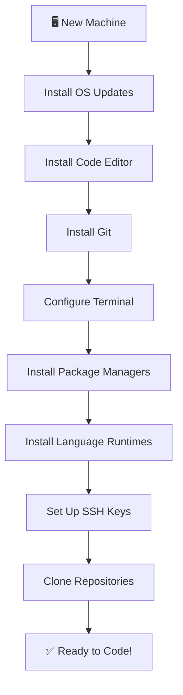

# 🏗️ Project Setup

> **Section 01** · Environment configuration, IDE setup, and project initialization guides.

---

## 📋 Table of Contents

- [Overview](#-overview)
- [What You'll Find Here](#-what-youll-find-here)
- [Guides](#-guides)
- [Quick Setup Checklist](#-quick-setup-checklist)
- [Development Environment Workflow](#-development-environment-workflow)
- [Related Sections](#-related-sections)

---

## 🔍 Overview

This section covers everything you need to set up a professional development environment from scratch. Whether you're configuring a new machine, setting up an IDE, or initializing a new project, you'll find step-by-step guides here.

---

## 📂 What You'll Find Here

| Topic | Description |
|-------|-------------|
| OS Setup | Configuring Windows, macOS, or Linux for development |
| IDE Configuration | VS Code, Android Studio, IntelliJ IDEA setup |
| Terminal Setup | Shell configuration, aliases, and tools |
| Package Managers | npm, pip, brew, choco, scoop |
| Environment Variables | Setting up PATH, system variables |
| Project Initialization | Starting new projects with best practices |

---

## 📚 Guides

> 📝 *Guides will be added here as they are documented.*

| # | Guide | Status |
|---|-------|--------|
| 1 | Windows Development Environment Setup | 🔲 Planned |
| 2 | VS Code Setup & Extensions | 🔲 Planned |
| 3 | Terminal & Shell Configuration | 🔲 Planned |
| 4 | Package Manager Setup | 🔲 Planned |
| 5 | Environment Variables Guide | 🔲 Planned |

---

## ✅ Quick Setup Checklist

Use this checklist when setting up a new development machine:

- [ ] Install operating system updates
- [ ] Install a code editor (VS Code recommended)
- [ ] Install Git and configure user info
- [ ] Install a package manager (npm, pip, brew)
- [ ] Set up terminal and shell preferences
- [ ] Configure environment variables
- [ ] Install language runtimes (Python, Node.js, Java)
- [ ] Set up SSH keys for GitHub
- [ ] Clone essential repositories
- [ ] Install browser developer tools

---

## 🔄 Development Environment Workflow

---

## 🔗 Related Sections

| Section | Why It's Related |
|---------|-----------------|
| [02 · Git & GitHub](../02_Git_GitHub/README.md) | Set up Git as part of your environment |
| [03 · AI Developer Tools](../03_AI_Developer_Tools/README.md) | Install AI coding assistants |
| [15 · Tools](../15_Tools/README.md) | Detailed tool documentation |

---

  <a href="../README.md">⬅️ Back to Home</a>

