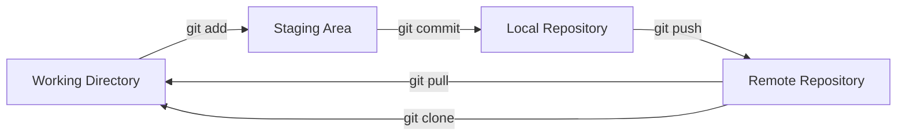
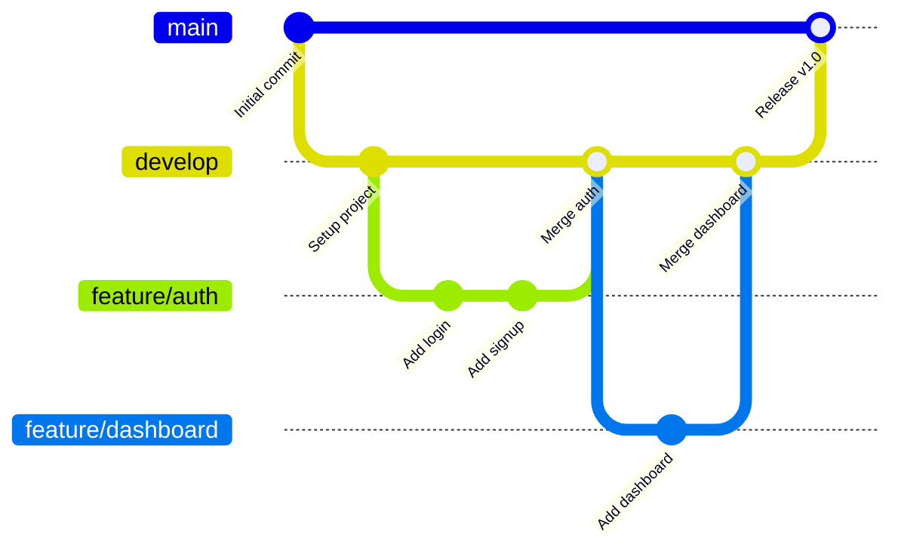

# 🔀 Git & GitHub

> **Section 02** · Version control, branching strategies, collaboration workflows, and GitHub features.

---

## 📋 Table of Contents

- [Overview](#-overview)
- [What You'll Find Here](#-what-youll-find-here)
- [Guides](#-guides)
- [Essential Git Commands](#-essential-git-commands)
- [Git Workflow](#-git-workflow)
- [Branching Strategy](#-branching-strategy)
- [Related Sections](#-related-sections)

---

## 🔍 Overview

Git is the foundation of modern software development. This section covers everything from basic Git commands to advanced workflows, branching strategies, and GitHub-specific features like Actions, Pages, and Issues.

---

## 📂 What You'll Find Here

| Topic | Description |
|-------|-------------|
| Git Basics | Init, add, commit, push, pull, clone |
| Branching | Create, merge, rebase, delete branches |
| Collaboration | Pull requests, code reviews, forks |
| Git Workflows | Gitflow, trunk-based, feature branching |
| GitHub Features | Actions, Pages, Issues, Projects, Releases |
| Advanced Git | Stash, cherry-pick, bisect, reflog |

---

## 📚 Guides

> 📝 *Guides will be added here as they are documented.*

| # | Guide | Status |
|---|-------|--------|
| 1 | Git Installation & Configuration | 🔲 Planned |
| 2 | Git Basics — Add, Commit, Push | 🔲 Planned |
| 3 | Branching & Merging | 🔲 Planned |
| 4 | Pull Requests & Code Reviews | 🔲 Planned |
| 5 | GitHub Actions — CI/CD Pipelines | 🔲 Planned |
| 6 | Git Workflow Strategies | 🔲 Planned |
| 7 | Advanced Git Techniques | 🔲 Planned |

---

## ⌨️ Essential Git Commands

| Command | Description |
|---------|-------------|
| `git init` | Initialize a new Git repository |
| `git clone <url>` | Clone a remote repository |
| `git add .` | Stage all changes |
| `git commit -m "msg"` | Commit staged changes |
| `git push origin main` | Push commits to remote |
| `git pull origin main` | Pull latest changes |
| `git branch <name>` | Create a new branch |
| `git checkout <branch>` | Switch to a branch |
| `git merge <branch>` | Merge a branch into current |
| `git log --oneline` | View commit history (compact) |
| `git stash` | Temporarily save uncommitted changes |
| `git diff` | View unstaged changes |

---

## 🔄 Git Workflow

---

## 🌿 Branching Strategy

---

## 🔗 Related Sections

| Section | Why It's Related |
|---------|-----------------|
| [01 · Project Setup](../01_Project_Setup/README.md) | Git is part of initial project setup |
| [10 · Cloud & DevOps](../10_Cloud_DevOps/README.md) | Git integrates with CI/CD pipelines |
| [14 · Checklists](../14_Checklists/README.md) | Pre-commit and pre-push checklists |

---

  <a href="../README.md">⬅️ Back to Home</a>

