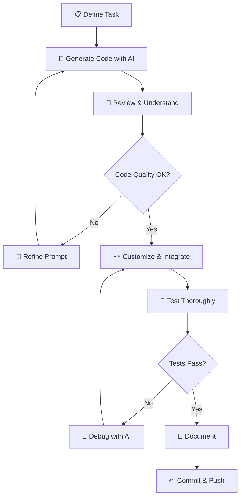

# 🤖 AI Developer Tools

> **Section 03** · AI-powered coding assistants, prompt engineering, and intelligent development workflows.

---

## 📋 Table of Contents

- [Overview](#-overview)
- [What You'll Find Here](#-what-youll-find-here)
- [Guides](#-guides)
- [AI Tools Landscape](#-ai-tools-landscape)
- [AI-Assisted Development Workflow](#-ai-assisted-development-workflow)
- [Related Sections](#-related-sections)

---

## 🔍 Overview

AI is transforming software development. From code generation and debugging to documentation and testing, AI-powered tools are becoming essential parts of the modern developer's toolkit. This section documents how to effectively use AI tools in your development workflow.

---

## 📂 What You'll Find Here

| Topic | Description |
|-------|-------------|
| AI Code Assistants | GitHub Copilot, Cursor, Codeium, Tabnine |
| AI Chat Models | ChatGPT, Claude, Gemini for development |
| MCP (Model Context Protocol) | Connecting AI to development tools |
| Prompt Engineering | Writing effective prompts for code generation |
| AI Workflows | Integrating AI into your development process |
| Local AI | Ollama, LM Studio, running models locally |

---

## 📚 Guides

> 📝 *Guides will be added here as they are documented.*

| # | Guide | Status |
|---|-------|--------|
| 1 | GitHub Copilot Setup & Usage | 🔲 Planned |
| 2 | Cursor IDE — AI-First Editor | 🔲 Planned |
| 3 | Claude for Development | 🔲 Planned |
| 4 | MCP (Model Context Protocol) | 🔲 Planned |
| 5 | Prompt Engineering for Developers | 🔲 Planned |
| 6 | Ollama — Local AI Models | 🔲 Planned |
| 7 | AI-Assisted Code Review | 🔲 Planned |

---

## 🗺️ AI Tools Landscape

| Category | Tools | Use Case |
|----------|-------|----------|
| Code Completion | Copilot, Codeium, Tabnine | Inline code suggestions |
| AI IDE | Cursor, Windsurf | Full AI-integrated editor |
| Chat Assistants | ChatGPT, Claude, Gemini | Q&A, debugging, learning |
| Local Models | Ollama, LM Studio | Privacy-first AI |
| Code Review | CodeRabbit, Sourcery | Automated PR reviews |
| Documentation | Mintlify, Readme.so | AI-generated docs |

---

## 🔄 AI-Assisted Development Workflow

---

## 🔗 Related Sections

| Section | Why It's Related |
|---------|-----------------|
| [01 · Project Setup](../01_Project_Setup/README.md) | Install AI tools as part of setup |
| [04 · Python](../04_Python/README.md) | AI tools work great with Python |
| [08 · AI & ML](../08_AI_ML/README.md) | AI/ML concepts behind these tools |
| [15 · Tools](../15_Tools/README.md) | Document each AI tool in detail |

---

  <a href="../README.md">⬅️ Back to Home</a>

