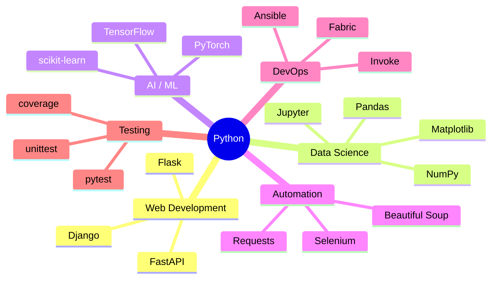
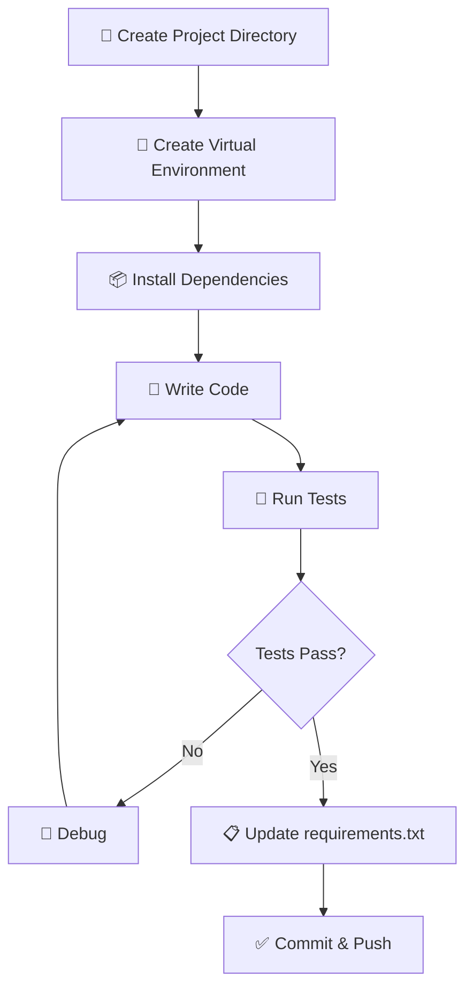

# 🐍 Python

> **Section 04** · Python language, libraries, virtual environments, packaging, and best practices.

---

## 📋 Table of Contents

- [Overview](#-overview)
- [What You'll Find Here](#-what-youll-find-here)
- [Guides](#-guides)
- [Python Ecosystem Overview](#-python-ecosystem-overview)
- [Python Development Workflow](#-python-development-workflow)
- [Essential Python Commands](#-essential-python-commands)
- [Related Sections](#-related-sections)

---

## 🔍 Overview

Python is one of the most versatile programming languages in the world. From web development and data science to automation and AI/ML, Python's ecosystem is massive. This section documents Python fundamentals, popular libraries, environment management, and professional development practices.

---

## 📂 What You'll Find Here

| Topic | Description |
|-------|-------------|
| Python Basics | Syntax, data types, control flow, functions, OOP |
| Virtual Environments | venv, virtualenv, conda, pyenv |
| Package Management | pip, poetry, pipenv |
| Web Frameworks | Django, Flask, FastAPI |
| Data Science | NumPy, Pandas, Matplotlib, Jupyter |
| Automation | Scripts, schedulers, file handling |
| Testing | pytest, unittest, coverage |
| Packaging | Creating and publishing Python packages |

---

## 📚 Guides

> 📝 *Guides will be added here as they are documented.*

| # | Guide | Status |
|---|-------|--------|
| 1 | Python Installation & Setup | 🔲 Planned |
| 2 | Virtual Environments (venv, conda) | 🔲 Planned |
| 3 | pip & Package Management | 🔲 Planned |
| 4 | Python Project Structure | 🔲 Planned |
| 5 | FastAPI — Modern Python APIs | 🔲 Planned |
| 6 | Django — Full-Stack Framework | 🔲 Planned |
| 7 | Testing with pytest | 🔲 Planned |
| 8 | Python for Automation | 🔲 Planned |

---

## 🗺️ Python Ecosystem Overview

---

## 🔄 Python Development Workflow

---

## ⌨️ Essential Python Commands

| Command | Description |
|---------|-------------|
| `python --version` | Check Python version |
| `python -m venv venv` | Create virtual environment |
| `source venv/bin/activate` | Activate venv (macOS/Linux) |
| `venv\Scripts\activate` | Activate venv (Windows) |
| `pip install <package>` | Install a package |
| `pip freeze > requirements.txt` | Export dependencies |
| `pip install -r requirements.txt` | Install from requirements |
| `python -m pytest` | Run tests |
| `python -m pip install --upgrade pip` | Update pip |
| `python <script.py>` | Run a Python script |

---

## 🔗 Related Sections

| Section | Why It's Related |
|---------|-----------------|
| [01 · Project Setup](../01_Project_Setup/README.md) | Python environment setup |
| [05 · Web Development](../05_Web_Development/README.md) | Python web frameworks |
| [07 · Database](../07_Database/README.md) | Python ORMs (SQLAlchemy, Django ORM) |
| [08 · AI & ML](../08_AI_ML/README.md) | Python is the primary AI/ML language |

---

  <a href="../README.md">⬅️ Back to Home</a>

