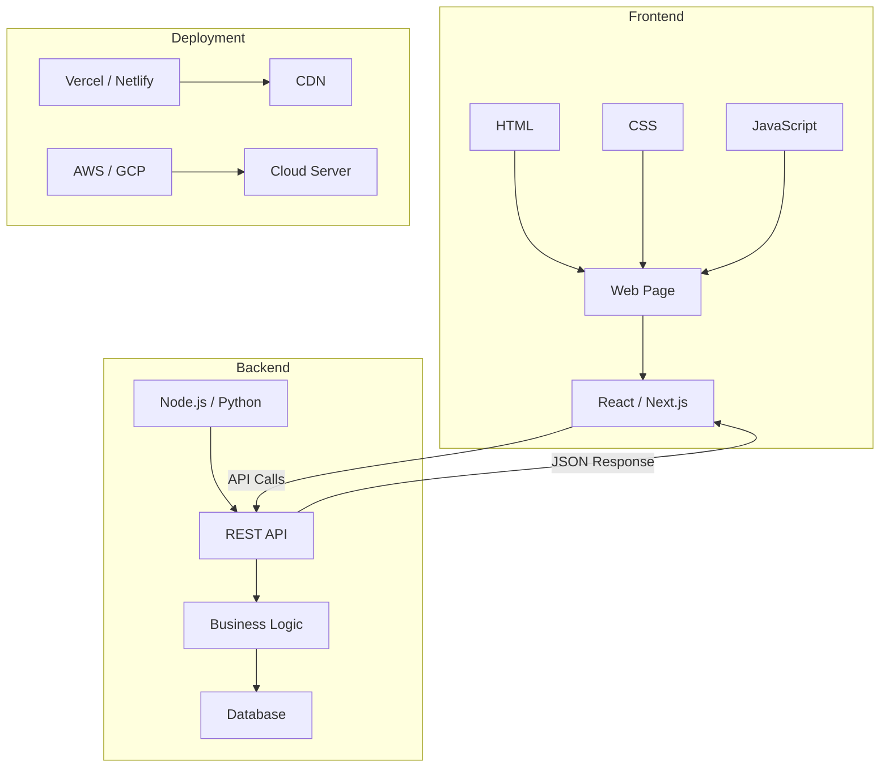
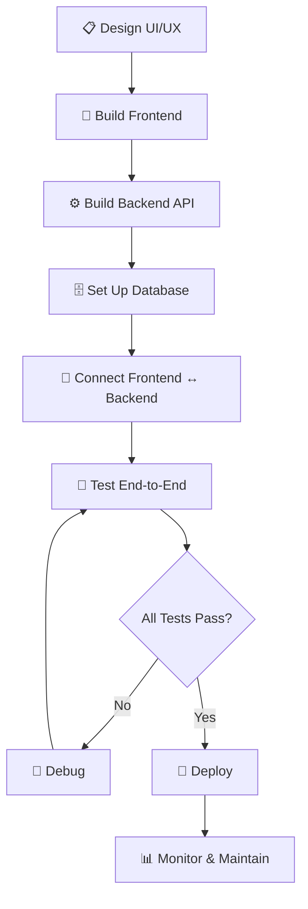

# 🌐 Web Development

> **Section 05** · Frontend, backend, full-stack development, APIs, and deployment.

---

## 📋 Table of Contents

- [Overview](#-overview)
- [What You'll Find Here](#-what-youll-find-here)
- [Guides](#-guides)
- [Web Development Stack](#-web-development-stack)
- [Full-Stack Development Workflow](#-full-stack-development-workflow)
- [Technology Comparison](#-technology-comparison)
- [Related Sections](#-related-sections)

---

## 🔍 Overview

Web development encompasses everything from building static HTML pages to deploying full-stack applications. This section covers frontend technologies (HTML, CSS, JavaScript, React), backend frameworks (Node.js, Django, FastAPI), APIs, and deployment strategies.

---

## 📂 What You'll Find Here

| Topic | Description |
|-------|-------------|
| HTML & CSS | Semantic HTML, modern CSS, responsive design |
| JavaScript | ES6+, DOM manipulation, async/await |
| React | Components, hooks, state management, Next.js |
| Backend | Node.js, Express, Django, FastAPI |
| APIs | REST, GraphQL, WebSockets |
| Deployment | Vercel, Netlify, Railway, AWS |
| Performance | Optimization, caching, lazy loading |

---

## 📚 Guides

> 📝 *Guides will be added here as they are documented.*

| # | Guide | Status |
|---|-------|--------|
| 1 | HTML & CSS Fundamentals | 🔲 Planned |
| 2 | JavaScript ES6+ Guide | 🔲 Planned |
| 3 | React — Getting Started | 🔲 Planned |
| 4 | Next.js — Full-Stack React | 🔲 Planned |
| 5 | Node.js & Express | 🔲 Planned |
| 6 | REST API Design | 🔲 Planned |
| 7 | Deployment Strategies | 🔲 Planned |
| 8 | CSS Frameworks (Tailwind, Bootstrap) | 🔲 Planned |

---

## 🗺️ Web Development Stack

---

## 🔄 Full-Stack Development Workflow

---

## 📊 Technology Comparison

### Frontend Frameworks

| Framework | Language | Best For | Learning Curve |
|-----------|----------|----------|---------------|
| React | JavaScript/TypeScript | SPAs, complex UIs | Medium |
| Next.js | JavaScript/TypeScript | Full-stack, SSR, SEO | Medium-High |
| Vue.js | JavaScript/TypeScript | Progressive apps | Low-Medium |
| Angular | TypeScript | Enterprise apps | High |
| Svelte | JavaScript | Performance-critical apps | Low |

### Backend Frameworks

| Framework | Language | Best For | Learning Curve |
|-----------|----------|----------|---------------|
| Express | JavaScript | APIs, microservices | Low |
| FastAPI | Python | High-performance APIs | Low-Medium |
| Django | Python | Full-stack, admin panels | Medium |
| Spring Boot | Java | Enterprise applications | High |
| Gin | Go | High-performance APIs | Medium |

---

## 🔗 Related Sections

| Section | Why It's Related |
|---------|-----------------|
| [04 · Python](../04_Python/README.md) | Python backend frameworks |
| [07 · Database](../07_Database/README.md) | Database integration for web apps |
| [10 · Cloud & DevOps](../10_Cloud_DevOps/README.md) | Deploying web applications |
| [11 · System Design](../11_System_Design/README.md) | Designing scalable web architectures |

---

  <a href="../README.md">⬅️ Back to Home</a>

