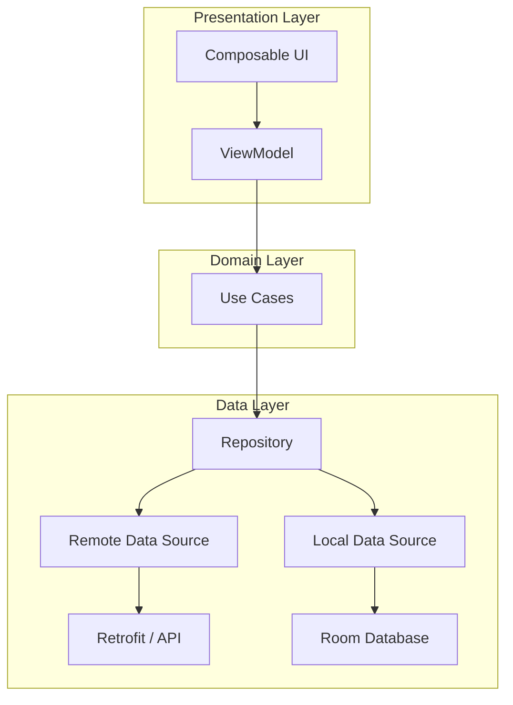
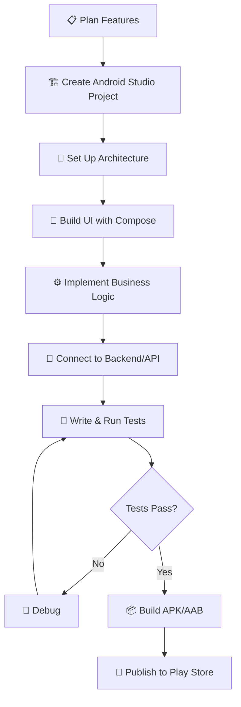

# 📱 Android Development

> **Section 06** · Android app development with Kotlin, Jetpack Compose, and Android Studio.

---

## 📋 Table of Contents

- [Overview](#-overview)
- [What You'll Find Here](#-what-youll-find-here)
- [Guides](#-guides)
- [Android Architecture](#-android-architecture)
- [Android Development Workflow](#-android-development-workflow)
- [Essential Tools](#-essential-tools)
- [Related Sections](#-related-sections)

---

## 🔍 Overview

Android powers billions of devices worldwide. This section covers Android app development using modern tools and practices — Kotlin as the primary language, Jetpack Compose for UI, Android Studio as the IDE, and best practices for architecture, testing, and publishing.

---

## 📂 What You'll Find Here

| Topic | Description |
|-------|-------------|
| Kotlin | Language fundamentals, coroutines, flows |
| Jetpack Compose | Modern declarative UI toolkit |
| Android Studio | IDE setup, debugging, profiling |
| Architecture | MVVM, Clean Architecture, Hilt (DI) |
| Networking | Retrofit, OkHttp, API integration |
| Storage | Room, DataStore, SharedPreferences |
| Testing | Unit tests, UI tests, Espresso |
| Publishing | Google Play Store deployment |

---

## 📚 Guides

> 📝 *Guides will be added here as they are documented.*

| # | Guide | Status |
|---|-------|--------|
| 1 | Android Studio Setup | 🔲 Planned |
| 2 | Kotlin Fundamentals | 🔲 Planned |
| 3 | Jetpack Compose — Getting Started | 🔲 Planned |
| 4 | MVVM Architecture | 🔲 Planned |
| 5 | Retrofit — API Calls | 🔲 Planned |
| 6 | Room Database | 🔲 Planned |
| 7 | Firebase Integration | 🔲 Planned |
| 8 | Publishing to Play Store | 🔲 Planned |

---

## 🏗️ Android Architecture

---

## 🔄 Android Development Workflow

---

## 🛠️ Essential Tools

| Tool | Purpose |
|------|---------|
| Android Studio | Official IDE for Android development |
| Gradle | Build system and dependency management |
| ADB | Android Debug Bridge — device communication |
| Firebase | Backend-as-a-service (auth, database, analytics) |
| Retrofit | Type-safe HTTP client for API calls |
| Room | SQLite abstraction for local database |
| Hilt | Dependency injection framework |
| LeakCanary | Memory leak detection |

---

## 🔗 Related Sections

| Section | Why It's Related |
|---------|-----------------|
| [01 · Project Setup](../01_Project_Setup/README.md) | Android Studio and SDK setup |
| [07 · Database](../07_Database/README.md) | Room, SQLite, Firebase databases |
| [05 · Web Development](../05_Web_Development/README.md) | API design for mobile backends |
| [10 · Cloud & DevOps](../10_Cloud_DevOps/README.md) | CI/CD for Android apps |

---

  <a href="../README.md">⬅️ Back to Home</a>

