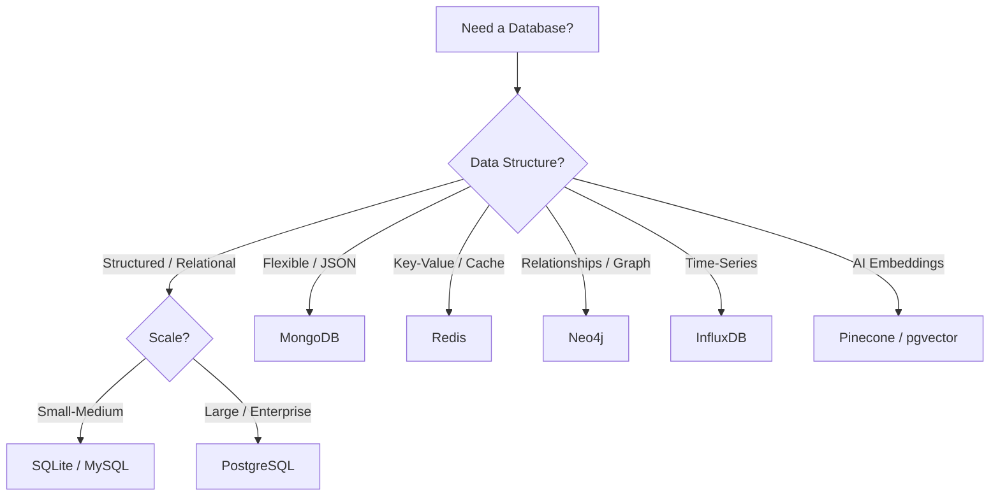

# 🗄️ Database

> **Section 07** · SQL, NoSQL, ORMs, migrations, and data management best practices.

---

## 📋 Table of Contents

- [Overview](#-overview)
- [What You'll Find Here](#-what-youll-find-here)
- [Guides](#-guides)
- [Database Types](#-database-types)
- [Database Selection Flowchart](#-database-selection-flowchart)
- [Essential SQL Commands](#-essential-sql-commands)
- [Related Sections](#-related-sections)

---

## 🔍 Overview

Databases are the backbone of almost every application. This section covers relational databases (PostgreSQL, MySQL), NoSQL databases (MongoDB, Redis), Object-Relational Mappers (ORMs), migrations, query optimization, and data modeling best practices.

---

## 📂 What You'll Find Here

| Topic | Description |
|-------|-------------|
| SQL Fundamentals | SELECT, JOIN, GROUP BY, subqueries |
| PostgreSQL | Advanced features, extensions, performance |
| MongoDB | Document-based NoSQL, aggregation |
| Redis | In-memory caching, pub/sub |
| ORMs | SQLAlchemy, Django ORM, Prisma, Room |
| Migrations | Schema versioning, Alembic, Flyway |
| Data Modeling | ER diagrams, normalization, indexing |
| Performance | Query optimization, indexing strategies |

---

## 📚 Guides

> 📝 *Guides will be added here as they are documented.*

| # | Guide | Status |
|---|-------|--------|
| 1 | SQL Fundamentals | 🔲 Planned |
| 2 | PostgreSQL Setup & Usage | 🔲 Planned |
| 3 | MongoDB — Getting Started | 🔲 Planned |
| 4 | Redis — Caching & Pub/Sub | 🔲 Planned |
| 5 | Database Design & Normalization | 🔲 Planned |
| 6 | ORM Guide (SQLAlchemy / Prisma) | 🔲 Planned |
| 7 | Database Migrations | 🔲 Planned |
| 8 | Query Optimization | 🔲 Planned |

---

## 🗺️ Database Types

| Type | Examples | Best For | Data Model |
|------|----------|----------|-----------|
| Relational (SQL) | PostgreSQL, MySQL, SQLite | Structured data, transactions | Tables with rows & columns |
| Document (NoSQL) | MongoDB, CouchDB | Flexible schemas, JSON data | Documents in collections |
| Key-Value | Redis, DynamoDB | Caching, sessions, real-time | Key-value pairs |
| Graph | Neo4j, ArangoDB | Relationships, social networks | Nodes & edges |
| Time-Series | InfluxDB, TimescaleDB | IoT, monitoring, metrics | Time-stamped data |
| Vector | Pinecone, ChromaDB, pgvector | AI/ML embeddings, similarity search | High-dimensional vectors |

---

## 🔄 Database Selection Flowchart

---

## ⌨️ Essential SQL Commands

| Command | Description |
|---------|-------------|
| `SELECT * FROM table` | Retrieve all rows |
| `INSERT INTO table VALUES (...)` | Insert a new row |
| `UPDATE table SET col = val WHERE ...` | Update rows |
| `DELETE FROM table WHERE ...` | Delete rows |
| `CREATE TABLE name (...)` | Create a new table |
| `ALTER TABLE name ADD col type` | Add a column |
| `DROP TABLE name` | Delete a table |
| `JOIN ... ON ...` | Combine tables |
| `GROUP BY col` | Aggregate by column |
| `CREATE INDEX idx ON table(col)` | Create an index |

---

## 🔗 Related Sections

| Section | Why It's Related |
|---------|-----------------|
| [04 · Python](../04_Python/README.md) | Python ORMs (SQLAlchemy, Django ORM) |
| [05 · Web Development](../05_Web_Development/README.md) | Backend database integration |
| [06 · Android](../06_Android/README.md) | Room database, Firebase |
| [11 · System Design](../11_System_Design/README.md) | Database architecture decisions |

---

  <a href="../README.md">⬅️ Back to Home</a>

