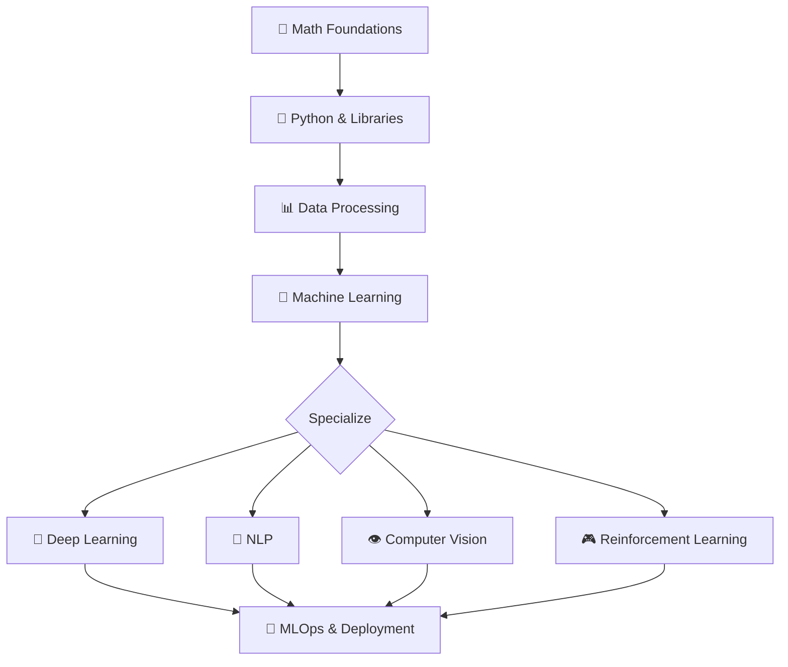
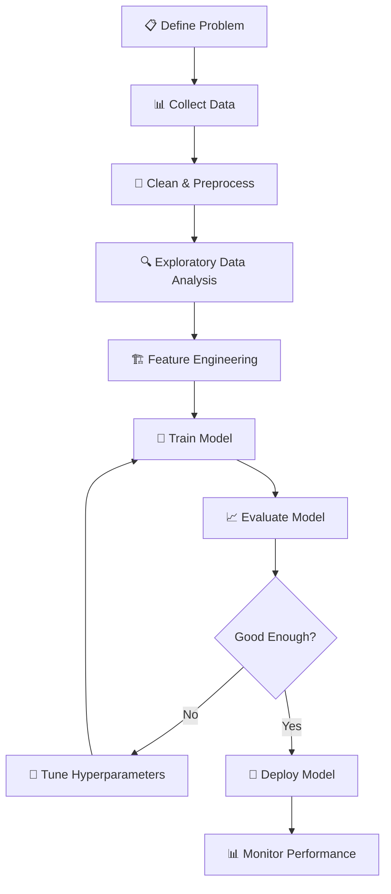

# 🧠 AI & Machine Learning

> **Section 08** · Artificial intelligence, machine learning, deep learning, NLP, and computer vision.

---

## 📋 Table of Contents

- [Overview](#-overview)
- [What You'll Find Here](#-what-youll-find-here)
- [Guides](#-guides)
- [AI/ML Learning Path](#-aiml-learning-path)
- [ML Project Workflow](#-ml-project-workflow)
- [Framework Comparison](#-framework-comparison)
- [Related Sections](#-related-sections)

---

## 🔍 Overview

Artificial Intelligence and Machine Learning are reshaping every industry. This section covers the fundamentals of ML, deep learning, natural language processing, computer vision, and the tools/frameworks used to build intelligent systems.

---

## 📂 What You'll Find Here

| Topic | Description |
|-------|-------------|
| ML Fundamentals | Supervised, unsupervised, reinforcement learning |
| Deep Learning | Neural networks, CNNs, RNNs, Transformers |
| NLP | Text processing, sentiment analysis, LLMs |
| Computer Vision | Image classification, object detection |
| Frameworks | TensorFlow, PyTorch, scikit-learn, Keras |
| Data Processing | Feature engineering, data cleaning, pipelines |
| MLOps | Model deployment, monitoring, versioning |
| Math for ML | Linear algebra, calculus, statistics, probability |

---

## 📚 Guides

> 📝 *Guides will be added here as they are documented.*

| # | Guide | Status |
|---|-------|--------|
| 1 | Machine Learning Fundamentals | 🔲 Planned |
| 2 | Python for Data Science (NumPy, Pandas) | 🔲 Planned |
| 3 | scikit-learn — Getting Started | 🔲 Planned |
| 4 | Deep Learning with PyTorch | 🔲 Planned |
| 5 | TensorFlow & Keras Guide | 🔲 Planned |
| 6 | Natural Language Processing | 🔲 Planned |
| 7 | Computer Vision Basics | 🔲 Planned |
| 8 | Model Deployment & MLOps | 🔲 Planned |

---

## 🗺️ AI/ML Learning Path

---

## 🔄 ML Project Workflow

---

## 📊 Framework Comparison

| Framework | Best For | Language | Learning Curve |
|-----------|----------|---------|---------------|
| scikit-learn | Classical ML | Python | Low |
| TensorFlow | Production DL, mobile | Python | Medium-High |
| PyTorch | Research, flexibility | Python | Medium |
| Keras | Rapid prototyping | Python | Low |
| Hugging Face | NLP, Transformers | Python | Low-Medium |
| OpenCV | Computer Vision | Python/C++ | Medium |
| JAX | High-performance research | Python | High |

---

## 🔗 Related Sections

| Section | Why It's Related |
|---------|-----------------|
| [03 · AI Developer Tools](../03_AI_Developer_Tools/README.md) | AI tools built on ML |
| [04 · Python](../04_Python/README.md) | Python is the primary ML language |
| [07 · Database](../07_Database/README.md) | Vector databases for AI |
| [10 · Cloud & DevOps](../10_Cloud_DevOps/README.md) | ML deployment on cloud |

---

  <a href="../README.md">⬅️ Back to Home</a>

