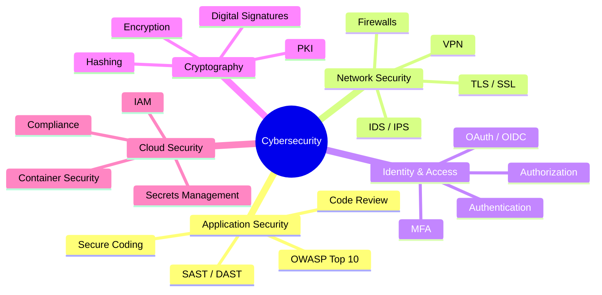
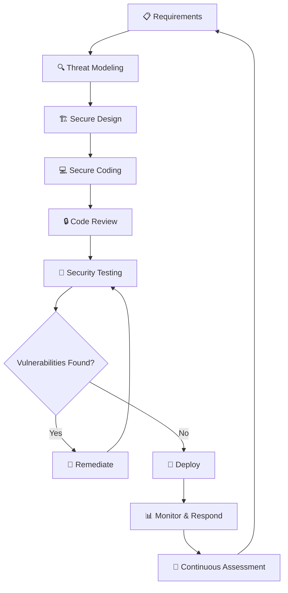

# 🔒 Cybersecurity

> **Section 09** · Security fundamentals, encryption, OWASP, penetration testing, and secure coding practices.

---

## 📋 Table of Contents

- [Overview](#-overview)
- [What You'll Find Here](#-what-youll-find-here)
- [Guides](#-guides)
- [Security Domains](#-security-domains)
- [Secure Development Lifecycle](#-secure-development-lifecycle)
- [OWASP Top 10 Quick Reference](#-owasp-top-10-quick-reference)
- [Related Sections](#-related-sections)

---

## 🔍 Overview

Cybersecurity is not optional — it's a fundamental responsibility of every developer. This section covers security principles, common vulnerabilities, encryption, authentication, secure coding practices, and tools for testing and hardening applications.

---

## 📂 What You'll Find Here

| Topic | Description |
|-------|-------------|
| Security Fundamentals | CIA triad, threat modeling, risk assessment |
| OWASP Top 10 | Most critical web application security risks |
| Authentication | OAuth, JWT, session management, MFA |
| Encryption | Hashing, symmetric/asymmetric encryption, TLS |
| Secure Coding | Input validation, SQL injection prevention |
| Penetration Testing | Tools, techniques, ethical hacking |
| Network Security | Firewalls, VPNs, DNS security |
| Compliance | GDPR, HIPAA, SOC 2 basics |

---

## 📚 Guides

> 📝 *Guides will be added here as they are documented.*

| # | Guide | Status |
|---|-------|--------|
| 1 | Security Fundamentals | 🔲 Planned |
| 2 | OWASP Top 10 Explained | 🔲 Planned |
| 3 | Authentication & Authorization | 🔲 Planned |
| 4 | Encryption & Hashing Guide | 🔲 Planned |
| 5 | Secure Coding Practices | 🔲 Planned |
| 6 | API Security | 🔲 Planned |
| 7 | Penetration Testing Basics | 🔲 Planned |
| 8 | Security Tools & Scanners | 🔲 Planned |

---

## 🗺️ Security Domains

---

## 🔄 Secure Development Lifecycle

---

## ⚠️ OWASP Top 10 Quick Reference

| # | Risk | Description |
|---|------|-------------|
| 1 | Broken Access Control | Unauthorized access to resources |
| 2 | Cryptographic Failures | Weak or missing encryption |
| 3 | Injection | SQL, NoSQL, OS command injection |
| 4 | Insecure Design | Missing security in architecture |
| 5 | Security Misconfiguration | Default or incomplete configs |
| 6 | Vulnerable Components | Outdated libraries and dependencies |
| 7 | Auth Failures | Broken authentication mechanisms |
| 8 | Software Integrity Failures | Untrusted updates, CI/CD issues |
| 9 | Logging Failures | Insufficient monitoring and logging |
| 10 | SSRF | Server-Side Request Forgery |

---

## 🔗 Related Sections

| Section | Why It's Related |
|---------|-----------------|
| [05 · Web Development](../05_Web_Development/README.md) | Web application security |
| [07 · Database](../07_Database/README.md) | Database security, SQL injection |
| [10 · Cloud & DevOps](../10_Cloud_DevOps/README.md) | Cloud security, secrets management |
| [14 · Checklists](../14_Checklists/README.md) | Security checklists |

---

  <a href="../README.md">⬅️ Back to Home</a>

