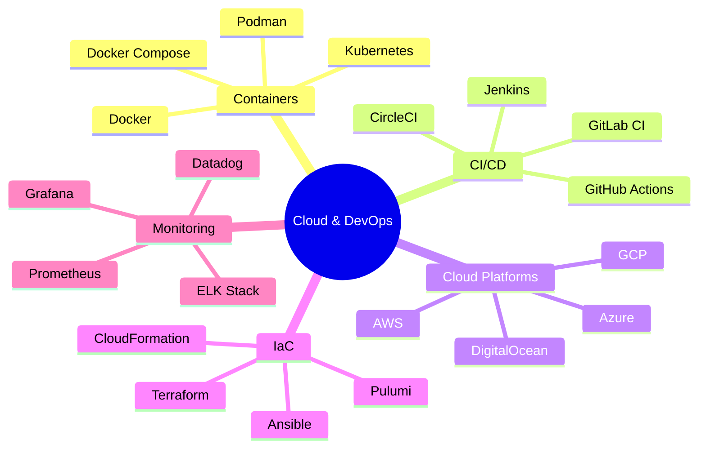
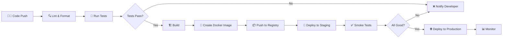

# ☁️ Cloud & DevOps

> **Section 10** · Cloud platforms, containerization, CI/CD pipelines, infrastructure as code, and deployment.

---

## 📋 Table of Contents

- [Overview](#-overview)
- [What You'll Find Here](#-what-youll-find-here)
- [Guides](#-guides)
- [Cloud & DevOps Ecosystem](#-cloud--devops-ecosystem)
- [CI/CD Pipeline](#-cicd-pipeline)
- [Platform Comparison](#-platform-comparison)
- [Related Sections](#-related-sections)

---

## 🔍 Overview

Cloud computing and DevOps practices are essential for modern software delivery. This section covers cloud platforms (AWS, GCP, Azure), containerization (Docker, Kubernetes), CI/CD pipelines, infrastructure as code (Terraform), and deployment strategies.

---

## 📂 What You'll Find Here

| Topic | Description |
|-------|-------------|
| Docker | Containerization, images, Compose |
| Kubernetes | Container orchestration, pods, services |
| CI/CD | GitHub Actions, Jenkins, automated pipelines |
| AWS | EC2, S3, Lambda, RDS, and more |
| GCP | Compute Engine, Cloud Run, Firebase |
| Terraform | Infrastructure as Code (IaC) |
| Monitoring | Prometheus, Grafana, logging |
| Deployment | Blue-green, canary, rolling deployments |

---

## 📚 Guides

> 📝 *Guides will be added here as they are documented.*

| # | Guide | Status |
|---|-------|--------|
| 1 | Docker — Getting Started | 🔲 Planned |
| 2 | Docker Compose | 🔲 Planned |
| 3 | Kubernetes Basics | 🔲 Planned |
| 4 | GitHub Actions — CI/CD | 🔲 Planned |
| 5 | AWS Fundamentals | 🔲 Planned |
| 6 | GCP & Firebase | 🔲 Planned |
| 7 | Terraform — Infrastructure as Code | 🔲 Planned |
| 8 | Deployment Strategies | 🔲 Planned |

---

## 🗺️ Cloud & DevOps Ecosystem

---

## 🔄 CI/CD Pipeline

---

## 📊 Platform Comparison

### Cloud Platforms

| Platform | Best For | Key Services | Free Tier |
|----------|----------|-------------|-----------|
| AWS | Enterprise, full-featured | EC2, S3, Lambda, RDS | 12 months |
| GCP | ML/AI, Kubernetes | GKE, BigQuery, Cloud Run | $300 credit |
| Azure | Enterprise, .NET | VMs, AKS, Cosmos DB | $200 credit |
| DigitalOcean | Simplicity, startups | Droplets, App Platform | $200 credit |
| Vercel | Frontend, Next.js | Serverless, Edge | Generous free |
| Railway | Full-stack, databases | Auto-deploy, Postgres | $5/month credit |

### Container Tools

| Tool | Purpose | Complexity |
|------|---------|-----------|
| Docker | Build & run containers | Low |
| Docker Compose | Multi-container apps | Low-Medium |
| Kubernetes | Container orchestration | High |
| Podman | Rootless containers | Low |

---

## 🔗 Related Sections

| Section | Why It's Related |
|---------|-----------------|
| [02 · Git & GitHub](../02_Git_GitHub/README.md) | Git triggers CI/CD pipelines |
| [05 · Web Development](../05_Web_Development/README.md) | Deploying web applications |
| [09 · Cybersecurity](../09_Cybersecurity/README.md) | Cloud security practices |
| [11 · System Design](../11_System_Design/README.md) | Cloud architecture patterns |

---

  <a href="../README.md">⬅️ Back to Home</a>

