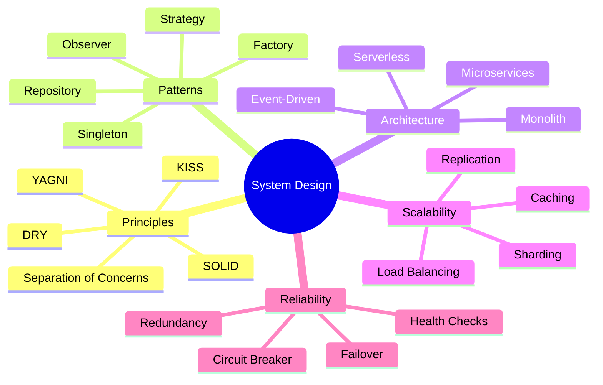
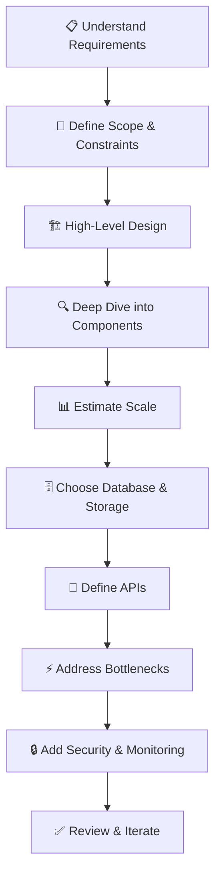

# 🏛️ System Design

> **Section 11** · Software architecture, design patterns, scalability, and system design principles.

---

## 📋 Table of Contents

- [Overview](#-overview)
- [What You'll Find Here](#-what-youll-find-here)
- [Guides](#-guides)
- [System Design Fundamentals](#-system-design-fundamentals)
- [Design Process](#-design-process)
- [Architecture Patterns](#-architecture-patterns)
- [Related Sections](#-related-sections)

---

## 🔍 Overview

System design is about making architectural decisions that affect scalability, reliability, and maintainability. This section covers design patterns, architectural styles, scalability strategies, and how to approach system design problems — essential for interviews and real-world engineering.

---

## 📂 What You'll Find Here

| Topic | Description |
|-------|-------------|
| Design Principles | SOLID, DRY, KISS, YAGNI |
| Design Patterns | Singleton, Factory, Observer, Strategy |
| Architecture Styles | Monolith, microservices, serverless, event-driven |
| Scalability | Horizontal/vertical scaling, load balancing |
| Distributed Systems | CAP theorem, consistency, partitioning |
| Caching | Redis, CDN, browser caching strategies |
| Message Queues | Kafka, RabbitMQ, SQS |
| API Design | REST, GraphQL, gRPC design principles |

---

## 📚 Guides

> 📝 *Guides will be added here as they are documented.*

| # | Guide | Status |
|---|-------|--------|
| 1 | SOLID Principles | 🔲 Planned |
| 2 | Design Patterns (GoF) | 🔲 Planned |
| 3 | Microservices Architecture | 🔲 Planned |
| 4 | Scalability & Load Balancing | 🔲 Planned |
| 5 | Caching Strategies | 🔲 Planned |
| 6 | Message Queues & Event-Driven Design | 🔲 Planned |
| 7 | System Design Interview Questions | 🔲 Planned |
| 8 | API Design Best Practices | 🔲 Planned |

---

## 🗺️ System Design Fundamentals

---

## 🔄 Design Process

---

## 📊 Architecture Patterns

| Pattern | Best For | Complexity | Scalability |
|---------|----------|-----------|------------|
| Monolith | Small teams, MVPs | Low | Limited |
| Microservices | Large teams, complex systems | High | High |
| Serverless | Event-driven, variable load | Medium | Auto-scaling |
| Event-Driven | Real-time, decoupled systems | High | High |
| Layered (N-Tier) | Traditional apps, clear separation | Low-Medium | Medium |
| CQRS | Read-heavy, complex queries | High | High |

---

## 🔗 Related Sections

| Section | Why It's Related |
|---------|-----------------|
| [05 · Web Development](../05_Web_Development/README.md) | Web application architecture |
| [07 · Database](../07_Database/README.md) | Database design decisions |
| [10 · Cloud & DevOps](../10_Cloud_DevOps/README.md) | Cloud architecture implementation |
| [12 · Placement Prep](../12_Placement_Preparation/README.md) | System design interview questions |

---

  <a href="../README.md">⬅️ Back to Home</a>

