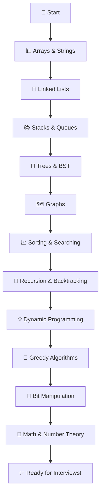
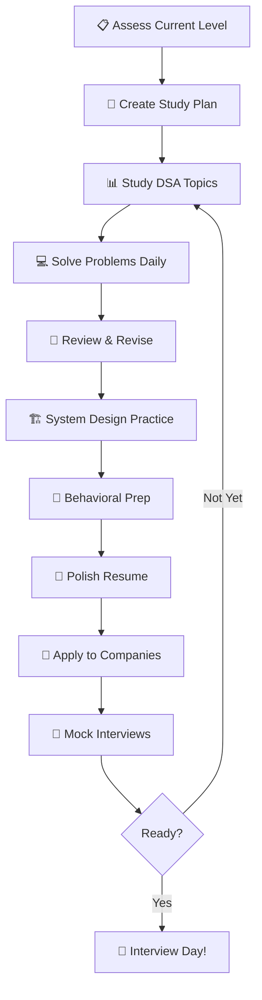

# 🎯 Placement Preparation

> **Section 12** · Data structures, algorithms, coding challenges, interview prep, and career guidance.

---

## 📋 Table of Contents

- [Overview](#-overview)
- [What You'll Find Here](#-what-youll-find-here)
- [Guides](#-guides)
- [DSA Roadmap](#-dsa-roadmap)
- [Interview Preparation Workflow](#-interview-preparation-workflow)
- [Topic-wise Progress Tracker](#-topic-wise-progress-tracker)
- [Related Sections](#-related-sections)

---

## 🔍 Overview

This section is dedicated to placement and interview preparation — covering data structures, algorithms, coding challenges, system design interviews, behavioral questions, and resume building. Whether you're preparing for campus placements or switching jobs, this section has you covered.

---

## 📂 What You'll Find Here

| Topic | Description |
|-------|-------------|
| Data Structures | Arrays, linked lists, trees, graphs, heaps |
| Algorithms | Sorting, searching, DP, greedy, backtracking |
| Problem Solving | LeetCode, HackerRank, Codeforces patterns |
| System Design Interviews | High-level design questions |
| Behavioral Interviews | STAR method, common questions |
| Resume Building | ATS-friendly resume, project highlights |
| Company-Specific Prep | FAANG, startups, product companies |
| Aptitude & Reasoning | Quantitative, logical, verbal |

---

## 📚 Guides

> 📝 *Guides will be added here as they are documented.*

| # | Guide | Status |
|---|-------|--------|
| 1 | DSA Roadmap — Complete Guide | 🔲 Planned |
| 2 | Arrays & Strings | 🔲 Planned |
| 3 | Linked Lists | 🔲 Planned |
| 4 | Trees & Binary Search Trees | 🔲 Planned |
| 5 | Graphs & BFS/DFS | 🔲 Planned |
| 6 | Dynamic Programming | 🔲 Planned |
| 7 | System Design Interview Guide | 🔲 Planned |
| 8 | Behavioral Interview Preparation | 🔲 Planned |
| 9 | Resume Building Guide | 🔲 Planned |

---

## 🗺️ DSA Roadmap

---

## 🔄 Interview Preparation Workflow

---

## 📊 Topic-wise Progress Tracker

| Topic | Problems Solved | Confidence | Status |
|-------|:-:|:-:|:-:|
| Arrays & Strings | 0 | ⬜⬜⬜⬜⬜ | 🔲 Not Started |
| Linked Lists | 0 | ⬜⬜⬜⬜⬜ | 🔲 Not Started |
| Stacks & Queues | 0 | ⬜⬜⬜⬜⬜ | 🔲 Not Started |
| Trees & BST | 0 | ⬜⬜⬜⬜⬜ | 🔲 Not Started |
| Graphs | 0 | ⬜⬜⬜⬜⬜ | 🔲 Not Started |
| Dynamic Programming | 0 | ⬜⬜⬜⬜⬜ | 🔲 Not Started |
| Sorting & Searching | 0 | ⬜⬜⬜⬜⬜ | 🔲 Not Started |
| Recursion & Backtracking | 0 | ⬜⬜⬜⬜⬜ | 🔲 Not Started |
| Greedy | 0 | ⬜⬜⬜⬜⬜ | 🔲 Not Started |
| Bit Manipulation | 0 | ⬜⬜⬜⬜⬜ | 🔲 Not Started |

---

## 🔗 Related Sections

| Section | Why It's Related |
|---------|-----------------|
| [04 · Python](../04_Python/README.md) | Python for coding interviews |
| [07 · Database](../07_Database/README.md) | SQL interview questions |
| [11 · System Design](../11_System_Design/README.md) | System design interview prep |
| [14 · Checklists](../14_Checklists/README.md) | Interview day checklists |

---

  <a href="../README.md">⬅️ Back to Home</a>

