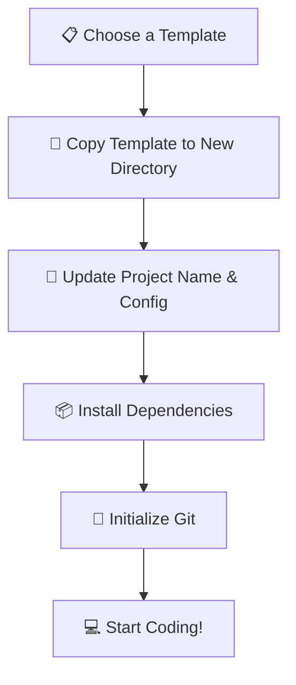

# 📦 Project Templates

> **Section 13** · Starter templates, boilerplates, and project scaffolds for quick setup.

---

## 📋 Table of Contents

- [Overview](#-overview)
- [What You'll Find Here](#-what-youll-find-here)
- [Templates](#-templates)
- [How to Use a Template](#-how-to-use-a-template)
- [Template Structure Standard](#-template-structure-standard)
- [Related Sections](#-related-sections)

---

## 🔍 Overview

Starting a new project from scratch wastes time. This section contains reusable project templates and boilerplates that include best-practice folder structures, configuration files, and starter code for various technology stacks.

---

## 📂 What You'll Find Here

| Topic | Description |
|-------|-------------|
| Python Templates | Flask, FastAPI, Django starter projects |
| Web Templates | React, Next.js, HTML/CSS/JS starters |
| Android Templates | Kotlin + Compose project structure |
| Full-Stack Templates | Frontend + Backend + Database |
| API Templates | REST API boilerplates |
| Script Templates | Python automation, data processing |
| Configuration | .gitignore, .env, linting, formatting configs |

---

## 📚 Templates

> 📝 *Templates will be added here as they are created.*

| # | Template | Stack | Status |
|---|---------|-------|--------|
| 1 | Python CLI Application | Python | 🔲 Planned |
| 2 | FastAPI REST API | Python, FastAPI | 🔲 Planned |
| 3 | React + Vite Frontend | React, TypeScript | 🔲 Planned |
| 4 | Next.js Full-Stack App | Next.js, TypeScript | 🔲 Planned |
| 5 | Android Kotlin App | Kotlin, Jetpack Compose | 🔲 Planned |
| 6 | Full-Stack Template | React + FastAPI + PostgreSQL | 🔲 Planned |
| 7 | Static Website | HTML, CSS, JavaScript | 🔲 Planned |
| 8 | Data Science Notebook | Python, Jupyter | 🔲 Planned |

---

## 🔄 How to Use a Template



### Steps

1. **Browse** the templates above and pick one that fits your project.
2. **Copy** the template folder to your new project directory.
3. **Rename** and update configuration files (package.json, pyproject.toml, etc.).
4. **Install** dependencies using the appropriate package manager.
5. **Initialize** a new Git repository.
6. **Start building** your project!

---

## 📐 Template Structure Standard

Every template in this section should include:

```
template-name/
├── README.md              ← Setup instructions
├── .gitignore             ← Appropriate ignore rules
├── .env.example           ← Environment variable template
├── src/                   ← Source code
├── tests/                 ← Test files
├── docs/                  ← Documentation (if needed)
└── config files           ← Linting, formatting, etc.
```

---

## 🔗 Related Sections

| Section | Why It's Related |
|---------|-----------------|
| [01 · Project Setup](../01_Project_Setup/README.md) | Templates speed up project setup |
| [02 · Git & GitHub](../02_Git_GitHub/README.md) | Every template initializes with Git |
| [14 · Checklists](../14_Checklists/README.md) | Project launch checklists |
| [15 · Tools](../15_Tools/README.md) | Tools used in templates |

---

<p align="center">
  <a href="../README.md">⬅️ Back to Home</a>
</p>
