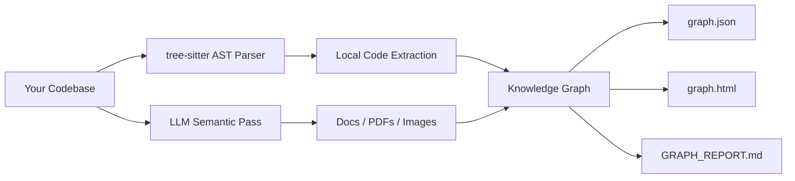
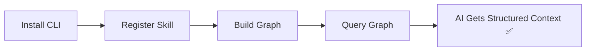
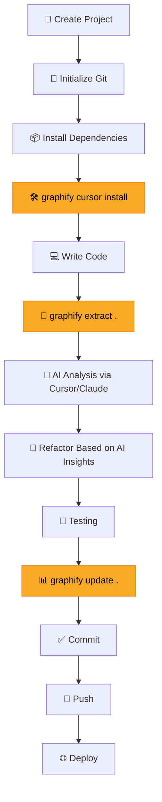
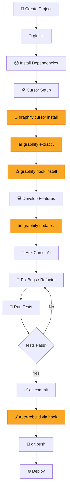

# 🛠️ Graphify

> **Category:** `CLI / AI Coding Skill / Knowledge Graph Engine`
> **Official Site:** [graphify.com](https://graphify.com)
> **Documentation:** [graphify.com/docs](https://graphify.com/docs)
> **GitHub:** [Graphify-Labs/graphify](https://github.com/Graphify-Labs/graphify)
> **Latest Stable Version:** `v8` (PyPI package: `graphifyy`)
> **License:** `MIT`
> **Supported Platforms:** `Windows · macOS · Linux`
> **Last Updated:** `2026-07-14`

---

## 📋 Table of Contents

- [Before Installing This Tool](#-before-installing-this-tool)
- [1. What is This Tool?](#1-what-is-this-tool)
- [2. Why Should I Use It?](#2-why-should-i-use-it)
- [3. When Should I Use It?](#3-when-should-i-use-it)
- [4. Where Can I Use It?](#4-where-can-i-use-it)
- [5. Installation](#5-installation)
- [6. How to Use It](#6-how-to-use-it)
- [7. Development Workflow](#7-development-workflow)
- [8. Best Practices](#8-best-practices)
- [9. Common Mistakes](#9-common-mistakes)
- [10. Useful Commands](#10-useful-commands)
- [11. Real Project Example](#11-real-project-example)
- [12. Limitations](#12-limitations)
- [13. Alternatives](#13-alternatives)
- [14. Resources](#14-resources)
- [15. My Personal Notes](#15-my-personal-notes)
- [My Workflow](#-my-workflow)

---

## ✋ Before Installing This Tool

> **Stop.** Before adding any new tool to your workflow, answer these questions honestly.

| # | Question | Answer |
|---|----------|--------|
| 1 | What problem does this tool solve? | AI coding assistants waste tokens grepping and reading files blindly. Graphify gives them a structured knowledge graph to query instead. |
| 2 | Why do I need this tool? | It dramatically reduces token usage (up to 71.5×) and gives AI assistants architectural understanding of your codebase — not just file contents. |
| 3 | Will I actually use it in my current or future projects? | ☑ Yes — works with Python, Next.js, Android, and all major stacks. |
| 4 | Is it better than the tool I already use? | ☑ Yes — unlike grep or vector search, it provides a real traversable graph with traced paths. |
| 5 | Is it actively maintained and widely adopted? | ☑ Yes — 85,000+ GitHub stars, 1,000+ commits, Y Combinator backed, active development on `v8` branch. |
| 6 | Is it compatible with my development stack? | ☑ Yes — supports 36+ languages and integrates with Cursor, Claude Code, Gemini CLI, Codex, and 15+ more. |
| 7 | Will it improve my productivity? | ☑ Yes — AI assistants give better answers faster with structured context instead of blind file reads. |
| 8 | Will I use it in multiple projects? | ☑ Yes — useful for any project with more than a few files, especially AI/ML, full-stack, and enterprise. |
| 9 | Is it worth spending time learning? | ☑ Yes — learning curve is minimal (one command to start), benefits are immediate. |
| 10 | Should I install it now or later? | ☑ Now — it improves every AI coding session from day one. |

> **Decision:** ☑ Install Now

### Project Suitability

| Project Type | Suitable? | Reasoning |
|-------------|:---------:|-----------|
| ✅ Small Projects | ☑ | Quick to run, minimal overhead; even small projects benefit from structured context |
| ✅ Medium Projects | ☑ | Sweet spot — enough complexity for the graph to provide real value |
| ✅ Large Projects | ☑ | Essential — AI assistants struggle most with large codebases without structural context |
| ✅ Open Source | ☑ | Commit `graphify-out/` so contributors start with a map of the codebase |
| ✅ AI Coding | ☑ | Purpose-built for AI coding workflows — this is its primary use case |
| ✅ Enterprise | ☑ | On-device, no telemetry, MIT license; Enterprise features in early access |

---

## 1. What is This Tool?

**Graphify** is an open-source CLI tool and AI coding assistant skill that transforms your entire project — code, documentation, PDFs, images, and videos — into a **queryable knowledge graph**. Instead of your AI assistant blindly grepping through files and burning tokens reading irrelevant code, Graphify gives it a structured map of your codebase that it can traverse, query, and reason over.

### The Problem It Solves

Traditional AI coding assistants (Cursor, Claude Code, Copilot, etc.) understand your codebase by reading files one by one, grepping for patterns, and stuffing as much raw text as possible into their context window. This approach is:

- **Token-wasteful** — the assistant reads hundreds of files to find what it needs
- **Context-blind** — it sees file contents but not how things connect across modules
- **Unreliable** — grepping returns text matches, not semantic relationships

Graphify solves this by building a **real graph** (not a vector index, not embeddings) where every node is a concept (class, function, module, doc section) and every edge is a relationship (`calls`, `imports`, `inherits`, `references`) with a confidence tag showing whether it was `EXTRACTED` directly from source or `INFERRED` by resolution.

### How It Works Internally



1. **Code files** are parsed **locally** using `tree-sitter` AST analysis — deterministic, no LLM, nothing leaves your machine
2. **Documentation, PDFs, and images** get a semantic pass through your AI assistant's model (or a configured API key)
3. The tool builds a **knowledge graph** with nodes (concepts) and edges (relationships)
4. **Community detection** clusters tightly-linked code into named modules automatically
5. Three output files are generated in `graphify-out/`:
   - `graph.html` — interactive visualization you can open in any browser
   - `GRAPH_REPORT.md` — highlights: god nodes, surprising connections, suggested questions
   - `graph.json` — the full machine-readable graph your AI assistant queries

### Key Features

- 🔒 **On-device** — code parsing is fully local; no telemetry, no analytics
- 🌐 **36+ languages** — Python, JS/TS, Go, Rust, Java, C/C++, Kotlin, Swift, and more
- 🤖 **15+ AI integrations** — Cursor, Claude Code, Codex, Gemini CLI, Copilot, Aider, etc.
- 📊 **Interactive visualization** — clickable `graph.html` with community filtering and search
- 🔍 **Query, don't grep** — `query`, `path`, and `explain` commands for structured answers
- 🏷️ **Confidence tags** — every edge is tagged `EXTRACTED`, `INFERRED`, or `AMBIGUOUS`
- 🪝 **Git hooks** — auto-rebuild on commit with union-merge for team collaboration
- 🌍 **Global graph** — cross-project knowledge graph for monorepos and microservices

---

## 2. Why Should I Use It?

### Advantages

| Benefit | Description |
|---------|-------------|
| ✅ **Massive Token Savings** | Up to 71.5× fewer tokens reported by users — AI assistants query the graph instead of reading hundreds of files |
| ✅ **Structural Understanding** | AI assistants understand *how* things connect, not just what files contain |
| ✅ **Traceable Answers** | Every answer traces to a path through the graph — you can audit what the AI relied on |
| ✅ **Better Refactoring** | `graphify path` shows exactly how two components connect — change one, know what breaks |
| ✅ **Better Debugging** | `graphify explain` reveals a node's connections, community, and degree — find the real dependency chain |
| ✅ **Better Documentation** | `GRAPH_REPORT.md` auto-generates architecture insights, god nodes, and surprising connections |
| ✅ **Zero Vendor Lock-in** | MIT license, open source, on-device — you own the graph, it's just a JSON file |
| ✅ **Team Collaboration** | Commit `graphify-out/` to git — everyone gets the map immediately; git hooks union-merge automatically |
| ✅ **No Embeddings Required** | Unlike RAG/vector approaches, Graphify builds a real graph you traverse — no vector store needed |
| ✅ **Faster Onboarding** | New team members query god nodes instead of reading 100 files — `NOTE:`, `WHY:`, and `HACK:` comments become linked nodes |

### Who Uses It?

- **Individual developers** using AI coding assistants daily
- **Open-source maintainers** who want contributors to understand the architecture fast
- **Engineering teams** at companies like Rootly AI Labs, MemVerge, and HKUST KnowComp
- **AI/ML researchers** who need to map complex codebases and papers into queryable graphs
- **Y Combinator** backed — growing rapidly with 85,000+ GitHub stars

---

## 3. When Should I Use It?

### ✅ Use It When

| Scenario | Why Graphify Helps |
|----------|-------------------|
| AI/ML Projects | Complex model architectures, training pipelines, and data flows become queryable |
| Python Projects | First-class tree-sitter support; most popular language in the Graphify ecosystem |
| React / Next.js | Maps component hierarchies, hook dependencies, and API routes |
| Java / Android | Understands inheritance trees, dependency injection, and activity lifecycles |
| Full Stack | Unifies frontend, backend, database schema, and infra in one graph |
| Large Codebases (1000+ files) | This is where Graphify shines most — AI assistants struggle without structural context |
| Open Source Projects | Commit the graph so contributors start with a map, not a maze |
| Enterprise Projects | On-device, no telemetry, MIT — meets data residency requirements |
| Multi-repo / Monorepo | `graphify global` merges graphs across projects into a cross-project graph |
| Code Review / PR Triage | `graphify prs --triage` ranks your review queue by graph impact |

### ❌ Don't Use It When

- **Single-file scripts** — if your project is one file, an AI assistant can read it directly
- **Throwaway prototypes** — if the code won't last beyond today, the graph isn't worth building
- **No AI assistant usage** — Graphify's value comes from improving AI-assisted coding; if you don't use AI tools, the benefit is limited to the visualization
- **Extremely sensitive air-gapped environments** — code parsing is local, but doc/PDF extraction needs an LLM (use `--backend ollama` for fully local extraction)

---

## 4. Where Can I Use It?

### Operating Systems

| OS | Supported | Notes |
|----|:---------:|-------|
| Windows | ✅ | Use `graphify .` (no leading `/`) in PowerShell |
| macOS | ✅ | `brew install python@3.12 uv` for quick setup |
| Linux | ✅ | Ubuntu/Debian: `sudo apt install python3.12 python3-pip` |

### Programming Languages (36+ Supported)

| Language | Supported | Language | Supported |
|----------|:---------:|----------|:---------:|
| Python | ✅ | Go | ✅ |
| JavaScript | ✅ | Rust | ✅ |
| TypeScript | ✅ | C# | ✅ |
| Java | ✅ | C / C++ | ✅ |
| Kotlin | ✅ | Swift | ✅ |
| PHP | ✅ | Ruby | ✅ |
| Scala | ✅ | Lua | ✅ |
| Dart | ✅ | Zig | ✅ |
| Elixir | ✅ | Julia | ✅ |
| SQL | ✅ | Shell/Bash | ✅ |
| Vue / Svelte / Astro | ✅ | Fortran | ✅ |
| Groovy / Gradle | ✅ | PowerShell | ✅ |
| Terraform (HCL) | ✅ | Pascal | ✅ |
| CUDA (.cu) | ✅ | Metal | ✅ |

### AI Assistants & Editors

| Platform | Install Command | Integration Method |
|----------|----------------|-------------------|
| **Cursor** | `graphify cursor install` | `.cursor/rules/graphify.mdc` (alwaysApply) |
| **Claude Code** | `graphify install` (default) | `CLAUDE.md` + PreToolUse hook |
| **Codex** | `graphify codex install` | `AGENTS.md` + PreToolUse hook |
| **Gemini CLI** | `graphify gemini install` | `GEMINI.md` + BeforeTool hook |
| **GitHub Copilot** | `graphify copilot install` | Skill file |
| **VS Code** | `graphify vscode install` | Extension integration |
| **Aider** | `graphify aider install` | `AGENTS.md` |
| **Kiro** | `graphify kiro install` | `.kiro/skills/` + steering |
| **Devin** | `graphify devin install` | Skill file + `.windsurf/rules/` |
| **Antigravity** | `graphify antigravity install` | `.agents/rules` + workflows |
| **OpenCode** | `graphify opencode install` | `AGENTS.md` + plugin |
| **Amp** | `graphify amp install` | Skill file |

### Real-World Use Cases

1. **Rootly AI Labs** — Turned incident data (incidents, alerts, teams, services) into a queryable knowledge graph for SRE workflows
2. **MemVerge** — Achieved 79× fewer tokens on a 496K-token codebase with zero vector database
3. **HKUST KnowComp** — Built DeepRefine-Skill using Graphify for academic code intelligence research

---

## 5. Installation

### Prerequisites

Before installing, make sure you have:

- [x] **Python 3.10+** — [Download from python.org](https://www.python.org/downloads/)
- [x] **uv** (recommended) or **pipx** — Package installer for isolated environments
- [x] **Git** — For hooks and team collaboration features

```bash
# Verify prerequisites
python --version    # Should be 3.10+
uv --version        # or: pipx --version
git --version
```

### Install

> **⚠️ Important:** The PyPI package name is `graphifyy` (double-y). The CLI command is still `graphify`.

**Windows:**
```powershell
# Install uv first (if not installed)
winget install astral-sh.uv

# Install Graphify (recommended method)
uv tool install graphifyy

# Register the skill with your AI assistant
graphify install
```

**macOS:**
```bash
# Install prerequisites via Homebrew
brew install python@3.12 uv

# Install Graphify
uv tool install graphifyy

# Register the skill
graphify install
```

**Linux (Ubuntu/Debian):**
```bash
# Install prerequisites
sudo apt install python3.12 python3-pip
curl -LsSf https://astral.sh/uv/install.sh | sh

# Install Graphify
uv tool install graphifyy

# Register the skill
graphify install
```

**Alternative installation methods:**
```bash
# Using pipx (alternative to uv)
pipx install graphifyy

# Using pip (not recommended — may need PATH setup)
pip install graphifyy

# With optional extras
uv tool install "graphifyy[pdf]"       # PDF support
uv tool install "graphifyy[office]"    # .docx, .xlsx support
uv tool install "graphifyy[video]"     # Video/audio/YouTube
uv tool install "graphifyy[mcp]"       # MCP server
uv tool install "graphifyy[all]"       # Everything
```

### Verify Installation

```bash
graphify --version
```

Expected output:
```
graphify v0.8.x
```

### Update

```bash
# Using uv
uv tool upgrade graphifyy

# Using pipx
pipx upgrade graphifyy

# Re-register skill after upgrade
graphify install
```

### Uninstall

```bash
# Remove from all AI platforms
graphify uninstall

# Remove and delete graphify-out/ directory
graphify uninstall --purge

# Uninstall the package
uv tool uninstall graphifyy
# or: pipx uninstall graphifyy
```

### PATH Fix (Windows)

If you see `graphify: command not found` after installing:

```powershell
# For uv installations — update shell PATH
uv tool update-shell

# Find the bin directory
uv tool dir --bin

# For pip installations — add to PATH manually
# Add %USERPROFILE%\.local\bin to your system PATH

# Alternative: run via Python module
python -m graphify --version
```

> **💡 Tip:** Always prefer `uv tool install` or `pipx install` over `pip install`. They create isolated environments and avoid PATH and module resolution issues.

### Common Installation Issues

| Issue | Cause | Solution |
|-------|-------|---------|
| `graphify: command not found` | Bin directory not on PATH | Run `uv tool update-shell`, open new terminal |
| `No solution found … no versions of graphify` | Using `uvx graphify` instead of package name | Use `uvx --from graphifyy graphify install` |
| `/graphify .` fails in PowerShell | Leading `/` is a path separator in PowerShell | Use `graphify .` (no slash) |
| `ModuleNotFoundError: No module named 'graphify'` | pip installed to different env | Use `uv tool install` or `pipx install` instead |

---

## 6. How to Use It

### Basic Workflow



### 🟢 Beginner Example

> First-time setup and your first graph in 30 seconds.

```bash
# Step 1: Install the CLI
uv tool install graphifyy

# Step 2: Register with your AI assistant (e.g., Cursor)
graphify cursor install

# Step 3: Build the graph (inside your project directory)
graphify extract .

# Step 4: Open the interactive visualization
# Open graphify-out/graph.html in your browser

# Step 5: Query the graph
graphify explain "main"
graphify query "what connects the auth module to the database?"
```

**Expected Output (explain):**
```
Node:       main
Source:     main.py L1
Community:  1 — Core Application
Degree:     12
Connections (12):
  --> UserService      [calls]    [EXTRACTED]
  --> DatabasePool     [uses]     [INFERRED]
  --> Config           [imports]  [EXTRACTED]
  <-- __init__.py      [imports]  [EXTRACTED]
```

### 🟡 Intermediate Example

> Platform-specific integrations and incremental updates.

```bash
# Cursor Integration
graphify cursor install
# Creates .cursor/rules/graphify.mdc with alwaysApply: true

# Codex Integration
graphify codex install
# Creates AGENTS.md + .codex/hooks.json PreToolUse hook

# Claude Code Integration
graphify install
# Default target — creates CLAUDE.md + PreToolUse hook

# Gemini CLI Integration
graphify gemini install
# Creates GEMINI.md + BeforeTool hook

# Incremental update (only changed files)
graphify update .

# Find path between two concepts
graphify path "UserService" "DatabasePool"

# Add external documentation to the graph
graphify add https://arxiv.org/abs/1706.03762

# Watch mode — auto-sync as files change
graphify watch ./src
```

### 🔴 Advanced Example

> Power-user workflows: global graphs, PR triage, hooks, and MCP server.

```bash
# Git hooks — auto-rebuild on every commit (AST only, no API cost)
graphify hook install

# Global graph — cross-project knowledge
graphify global add graphify-out/graph.json --as my-ml-project
graphify global add ../frontend/graphify-out/graph.json --as frontend
graphify global list

# PR Dashboard with AI triage
graphify prs                    # Overview: CI, review, worktree mapping
graphify prs 42                 # Deep dive on PR #42 with graph impact
graphify prs --triage           # AI ranks your review queue
graphify prs --conflicts        # PRs sharing graph communities

# Clone and graph a repo in one shot
graphify clone https://github.com/karpathy/nanoGPT

# Merge two graphs
graphify merge-graphs a.json b.json --out merged.json

# Export architecture diagrams
graphify export callflow-html

# MCP Server — serve graph over HTTP for the team
python -m graphify.serve graphify-out/graph.json --transport http --port 8080

# Deep extraction mode with specific backend
graphify extract ./docs --mode deep --backend gemini --model gemini-2.5-pro

# Headless CI extraction
GEMINI_API_KEY=your-key graphify extract ./docs --backend gemini
```

---

## 7. Development Workflow

> Where does Graphify fit in the development lifecycle?



> **💡 Note:** The yellow nodes show where Graphify integrates into your workflow. With `graphify hook install`, the update step happens automatically on every commit.

### Integration Points

| Stage | How Graphify Helps |
|-------|-------------------|
| **Setup** | `graphify cursor install` registers the skill — AI assistant starts using the graph automatically |
| **Initial Development** | `graphify extract .` builds the first graph; AI assistant gets architectural context from day one |
| **Active Development** | `graphify update .` incrementally updates only changed files — fast and cheap |
| **Code Review** | `graphify prs --triage` ranks PRs by graph impact; `graphify path` shows ripple effects |
| **Debugging** | `graphify explain "BrokenComponent"` shows all connections; `graphify query` finds root causes |
| **Refactoring** | `graphify path A B` traces how components connect — know what breaks before you change it |
| **Onboarding** | New team members query the graph instead of reading 100 files; `GRAPH_REPORT.md` provides instant architecture overview |
| **CI/CD** | `graphify extract` runs headless in CI; `graphify hook install` sets up post-commit auto-rebuild |

---

## 8. Best Practices

> Professional recommendations for using Graphify effectively.

### Do's ✅

1. **Run `graphify hook install` on every project** — Auto-rebuilds the AST graph on every commit at zero API cost. Also sets up a git merge driver so `graph.json` never gets conflict markers.

2. **Commit `graphify-out/` to your repository** — Everyone on the team gets the graph immediately on pull. New contributors start with a map, not a maze.

3. **Use `--update` for incremental rebuilds** — Don't rebuild the entire graph when only a few files changed. `graphify update .` re-extracts only modified files.

4. **Add a `.graphifyignore` file** — Same syntax as `.gitignore`. Exclude `node_modules/`, `dist/`, generated files, and test fixtures to keep the graph focused.

5. **Use `graphify query` before grepping** — Train yourself (and your AI assistant) to query the graph first. It returns scoped subgraphs, not noisy text matches.

6. **Use `--mode deep` for documentation-heavy projects** — Enables more aggressive relationship extraction from docs, PDFs, and comments.

7. **Add `# NOTE:`, `# WHY:`, and `# HACK:` comments in your code** — Graphify extracts these as separate nodes linked to the code they explain, creating richer context for AI assistants.

8. **Use `graphify explain` to understand unfamiliar code** — Before diving into a new module, run `explain` on its key symbols to see connections, community, and degree.

9. **Use the global graph for multi-repo architectures** — `graphify global add` merges graphs across projects so your AI assistant understands cross-service dependencies.

10. **Add `graphify-out/cost.json` to `.gitignore`** — This tracks your personal API usage and shouldn't be shared. The graph itself should be committed.

11. **Re-run `graphify install` after upgrading** — The skill file needs to match your CLI version. Always re-register after `uv tool upgrade graphifyy`.

12. **Use `--backend ollama` for air-gapped environments** — Fully local extraction with no API calls for both code and documentation.

13. **Run `graphify prs --triage` before your daily code review** — AI-ranked PR queue saves time by surfacing the most impactful changes first.

14. **Use project-scoped installs for team repos** — `graphify install --project` writes config under the current directory so it's committed and shared.

15. **Add `graphify-out/` to `.claudeignore`** — Prevents Claude Code from re-reading graph output files and invalidating its prompt cache.

### Don'ts ❌

1. **Don't use `pip install` on Mac/Windows if possible** — Use `uv tool install` or `pipx install` to avoid PATH and module resolution issues.

2. **Don't skip the skill registration step** — Running `graphify extract` builds the graph, but your AI assistant won't use it until you run `graphify cursor install` (or equivalent).

3. **Don't rebuild the full graph after every small change** — Use `--update` for incremental updates. Full rebuilds are only needed after major refactors.

4. **Don't ignore the `GRAPH_REPORT.md`** — It contains god nodes, surprising connections, and suggested questions that provide immediate architectural insight.

5. **Don't use `/graphify` with a leading slash in PowerShell** — PowerShell treats `/` as a path separator. Use `graphify .` instead.

---

## 9. Common Mistakes

> Mistakes beginners commonly make and how to fix them.

### Mistake 1: Installing Package `graphify` Instead of `graphifyy`

**Problem:**
```
ERROR: No matching distribution found for graphify
```

**Solution:**
```bash
# The PyPI package has a double-y
uv tool install graphifyy
```

**Why:** The package name on PyPI is `graphifyy` (two y's). Other `graphify*` packages are not affiliated. The CLI command is still `graphify`.

---

### Mistake 2: Using `/graphify` in PowerShell

**Problem:**
```
/graphify : The term '/graphify' is not recognized as the name of a cmdlet
```

**Solution:**
```powershell
# Drop the leading slash on Windows
graphify .
```

**Why:** PowerShell interprets `/` as a path separator, not a command prefix. Use `graphify .` (no slash) on Windows.

---

### Mistake 3: Forgetting to Register the Skill

**Problem:**
AI assistant doesn't use the graph even though `graphify-out/` exists.

**Solution:**
```bash
# Register with your specific platform
graphify cursor install    # for Cursor
graphify install           # for Claude Code (default)
graphify codex install     # for Codex
graphify gemini install    # for Gemini CLI
```

**Why:** Building the graph (`graphify extract .`) creates the data files, but your AI assistant needs a skill/instruction file to know it should consult the graph.

---

### Mistake 4: Not Updating the Graph After Code Changes

**Problem:**
AI assistant references outdated code structure or deleted files.

**Solution:**
```bash
# Incremental update (fast — only changed files)
graphify update .

# Or install git hooks for automatic updates
graphify hook install
```

**Why:** The graph is a snapshot. Without updates, it becomes stale. Git hooks auto-rebuild on every commit.

---

### Mistake 5: Rebuilding Full Graph When Only a Few Files Changed

**Problem:**
Full graph rebuild takes minutes and costs API tokens for docs/PDFs.

**Solution:**
```bash
# Use --update flag for incremental rebuilds
graphify extract . --update

# Or for code-only changes (free, local)
graphify update .
```

**Why:** `--update` re-extracts only changed files. Code extraction is always free (local AST). Only doc/PDF changes require API calls.

---

### Mistake 6: Graph Has Fewer Nodes After Rebuild

**Problem:**
After a refactor that deleted files, the graph silently loses nodes.

**Solution:**
```bash
# Force overwrite even if new graph is smaller
graphify extract . --force
# or
GRAPHIFY_FORCE=1 graphify update .
```

**Why:** By default, Graphify protects against accidental data loss by keeping the larger graph. After intentional refactors, use `--force`.

---

### Mistake 7: `graphify: command not found` After Installing

**Problem:**
```
graphify: command not found
```

**Solution:**
```bash
# For uv installations
uv tool update-shell
# Then open a NEW terminal

# For pipx installations
pipx ensurepath
# Then open a NEW terminal

# For pip installations — find your bin dir
python -m graphify --version  # verify it works
```

**Why:** The CLI binary is installed to a tool bin directory (`~/.local/bin`) that may not be on your shell's PATH.

---

### Mistake 8: Empty Nodes/Edges for Docs and PDFs

**Problem:**
Code nodes appear fine, but documentation nodes are empty.

**Solution:**
```bash
# Set an API key for semantic extraction
GEMINI_API_KEY=your-key graphify extract ./docs --backend gemini
# Or use fully local extraction
graphify extract ./docs --backend ollama
```

**Why:** Code is parsed locally via tree-sitter (no API needed). Docs, PDFs, and images require an LLM call for semantic extraction.

---

### Mistake 9: Not Adding `.graphifyignore`

**Problem:**
Graph includes `node_modules/`, `dist/`, `.venv/`, and generated files — cluttered and slow.

**Solution:**
```bash
# Create .graphifyignore in project root
echo "node_modules/
dist/
.venv/
*.generated.py
*.min.js" > .graphifyignore
```

**Why:** Without ignore rules, Graphify indexes everything Git tracks. Large dependency trees bloat the graph and slow extraction.

---

### Mistake 10: Using `uvx graphify` Instead of Named Package

**Problem:**
```
No solution found … no versions of graphify
```

**Solution:**
```bash
# Name the package explicitly
uvx --from graphifyy graphify install

# Or install once and use directly
uv tool install graphifyy
graphify install
```

**Why:** `uvx` treats the first word as a package name. The package is `graphifyy`, but the command is `graphify`.

---

### Mistake 11: Claude Code Prompt Cache Invalidated After Extract

**Problem:**
Claude Code re-uploads the full context after every `graphify extract`.

**Solution:**
```bash
# Add to .claudeignore
echo "graph.json
graphify-out/" >> .claudeignore
```

**Why:** Graphify writes to `graphify-out/` in the workspace. Without `.claudeignore`, every write invalidates Claude Code's prompt cache.

---

### Mistake 12: Skill Version Mismatch Warning

**Problem:**
```
Warning: skill version mismatch — installed graphify differs from skill file
```

**Solution:**
```bash
uv tool upgrade graphifyy
graphify install  # Re-register after upgrade
```

**Why:** The skill file written by `graphify install` must match the CLI version. Always re-register after upgrading.

---

### Mistake 13: Ollama Runs Out of VRAM

**Problem:**
```
CUDA out of memory / context window exceeded
```

**Solution:**
```bash
GRAPHIFY_OLLAMA_NUM_CTX=8192 graphify extract ./docs --backend ollama --token-budget 4000
```

**Why:** The KV-cache window is auto-sized but may exceed your GPU's VRAM. Reduce context size and token budget.

---

### Mistake 14: Git Conflict Markers in `graph.json`

**Problem:**
Two developers commit graphs at the same time, creating merge conflicts.

**Solution:**
```bash
# Install git hooks — includes union-merge driver for graph.json
graphify hook install
```

**Why:** The hook sets up a custom git merge driver that automatically union-merges `graph.json`, preventing conflicts entirely.

---

### Mistake 15: Not Committing `graphify-out/` to Git

**Problem:**
Every team member must rebuild the graph from scratch; new contributors have no map.

**Solution:**
```bash
# Commit the graph output (but ignore cost.json)
echo "graphify-out/cost.json" >> .gitignore
git add graphify-out/
git commit -m "feat: add graphify knowledge graph"
```

**Why:** `graphify-out/` is designed to be committed. `manifest.json` uses relative paths and is portable across machines.

---

## 10. Useful Commands

> Quick reference table for the most important commands.

### Core Commands

| Command | Description | Example |
|---------|-------------|---------|
| `graphify extract .` | Build graph for current directory | `graphify extract ./my-project` |
| `graphify update .` | Incremental update (changed files only) | `graphify update ./src` |
| `graphify query "..."` | Query the graph with natural language | `graphify query "what connects auth to DB?"` |
| `graphify explain "Node"` | Explain a specific node's connections | `graphify explain "UserService"` |
| `graphify path "A" "B"` | Find shortest path between two concepts | `graphify path "FastAPI" "ModelField"` |
| `graphify add <URL>` | Add external docs/papers to the graph | `graphify add https://arxiv.org/abs/1706.03762` |
| `graphify --version` | Print installed version | `graphify --version` |

### Platform Integration

| Command | Description |
|---------|-------------|
| `graphify install` | Register with Claude Code (default) |
| `graphify cursor install` | Register with Cursor |
| `graphify codex install` | Register with Codex |
| `graphify gemini install` | Register with Gemini CLI |
| `graphify copilot install` | Register with GitHub Copilot |
| `graphify aider install` | Register with Aider |
| `graphify uninstall` | Remove from all platforms |
| `graphify uninstall --purge` | Remove + delete `graphify-out/` |

### Advanced Commands

| Command | Description | Example |
|---------|-------------|---------|
| `graphify extract . --mode deep` | Aggressive relationship extraction | For documentation-heavy projects |
| `graphify extract . --update` | Re-extract only changed files | Fast incremental updates |
| `graphify extract . --force` | Overwrite even if graph is smaller | Use after refactors |
| `graphify extract . --no-viz` | Skip HTML, just report + JSON | Faster for CI |
| `graphify extract . --watch` | Auto-sync as files change | Dev mode |
| `graphify hook install` | Post-commit + post-checkout hooks | Auto-rebuild on commit |
| `graphify export callflow-html` | Generate Mermaid architecture HTML | `graphify export callflow-html --output docs/arch.html` |
| `graphify clone <URL>` | Clone and graph a repo | `graphify clone https://github.com/karpathy/nanoGPT` |
| `graphify merge-graphs a.json b.json` | Combine two graphs | `--out merged.json` |
| `graphify prs` | PR dashboard: CI, review, graph impact | `graphify prs 42` for deep dive |
| `graphify prs --triage` | AI-ranked review queue | Auto-detects backend |
| `graphify prs --conflicts` | PRs sharing graph communities | Merge-order risk |
| `graphify global add graph.json --as name` | Add to cross-project graph | Multi-repo support |
| `graphify global list` | Show all registered repos | Node/edge counts |
| `graphify cluster-only .` | Rerun clustering without re-extracting | `--resolution 1.5` for more granular |
| `graphify reflect` | Aggregate lessons from work memory | `graphify reflect --if-stale` |

### Extraction Backends

| Command | Description |
|---------|-------------|
| `graphify extract . --backend gemini` | Use Google Gemini API |
| `graphify extract . --backend claude` | Use Anthropic Claude API |
| `graphify extract . --backend openai` | Use OpenAI API |
| `graphify extract . --backend ollama` | Fully local via Ollama |
| `graphify extract . --backend bedrock` | AWS Bedrock (IAM auth) |
| `graphify extract . --backend azure` | Azure OpenAI |
| `graphify extract . --backend deepseek` | DeepSeek API |
| `graphify extract . --backend claude-cli` | Route through Claude Code CLI |

---

## 11. Real Project Example

> A concrete example showing how Graphify was used in an actual AI/ML project.

### Project: AI-Powered Smart Campus System

**Why Graphify was installed:**
- The project spans Python (FastAPI backend), Next.js (frontend), and Android (Kotlin) — AI assistants struggled to understand cross-platform connections
- Training pipelines, data processing, and API endpoints created complex dependency chains
- New team members spent days understanding the architecture before contributing

**How it was integrated:**

```
smart-campus/
├── backend/
│   ├── app/
│   │   ├── main.py
│   │   ├── models/
│   │   │   ├── user.py
│   │   │   ├── attendance.py
│   │   │   └── prediction.py
│   │   ├── routes/
│   │   │   ├── auth.py
│   │   │   ├── api.py
│   │   │   └── ml_endpoints.py
│   │   ├── services/
│   │   │   ├── ml_service.py
│   │   │   ├── firebase_service.py
│   │   │   └── notification_service.py
│   │   └── ml/
│   │       ├── train.py
│   │       ├── predict.py
│   │       └── preprocessing.py
│   ├── requirements.txt
│   └── pyproject.toml
├── frontend/
│   ├── src/
│   │   ├── app/
│   │   ├── components/
│   │   └── lib/
│   ├── package.json
│   └── next.config.js
├── android/
│   ├── app/src/main/java/
│   └── build.gradle.kts
├── .cursor/
│   └── rules/
│       └── graphify.mdc          ← Auto-generated by graphify cursor install
├── .graphifyignore                ← Exclude node_modules, .venv, etc.
├── graphify-out/                  ← Committed to git
│   ├── graph.html
│   ├── GRAPH_REPORT.md
│   └── graph.json
├── .gitignore
└── README.md
```

**Setup commands used:**
```bash
# Initial setup
cd smart-campus
uv tool install graphifyy
graphify cursor install

# Build the initial graph
graphify extract .

# Install git hooks for automatic updates
graphify hook install

# Open visualization
# Open graphify-out/graph.html in browser
```

**When to rebuild the graph:**
- **Automatic** (via git hooks): After every commit — code-only AST rebuild, zero API cost
- **Manual**: After adding new documentation, PDFs, or design docs — `graphify update . --mode deep`
- **Full rebuild**: After major refactors that delete many files — `graphify extract . --force`

**How Graphify improves AI understanding:**
```bash
# Before Graphify: "Read all files in backend/app/ to understand the auth flow"
# → AI reads 15+ files, burns 50,000+ tokens, misses cross-module connections

# After Graphify:
graphify query "how does the auth flow connect to Firebase?"
# → AI gets a scoped subgraph with exact path: auth.py → firebase_service.py → Firebase SDK

graphify explain "ml_service"
# → Shows all connections: train.py, predict.py, ml_endpoints.py, preprocessing.py
# → Community: ML Pipeline (auto-detected cluster)
# → Degree: 23 connections
```

**Benefits Gained:**
- **Token reduction**: ~60× fewer tokens for architecture questions
- **Faster onboarding**: New contributors query the graph instead of reading the whole codebase
- **Better refactoring**: `graphify path` shows ripple effects before making changes
- **Auto-updated**: Git hooks keep the graph in sync without manual effort
- **Cross-platform visibility**: One graph covers Python + Next.js + Kotlin

---

## 12. Limitations

> Be honest about what this tool cannot do.

| Limitation | Details | Workaround |
|-----------|---------|------------|
| **Docs/PDFs need an LLM** | Semantic extraction for non-code files requires an API key or local model | Use `--backend ollama` for fully local; or only extract code (free, no API) |
| **Large HTML visualizations** | `graph.html` becomes slow with 5000+ nodes | Use `--no-viz` and query via CLI; or filter by community |
| **No real-time sync** | Graph is a snapshot, not a live index | Use `graphify watch` or `graphify hook install` for near-real-time |
| **Community detection is heuristic** | Auto-detected clusters may not perfectly match your mental model | Use `--resolution` flag to tune granularity; manually review `GRAPH_REPORT.md` |
| **Inferred edges can be wrong** | `INFERRED` relationships are best-effort | Every edge is tagged — check `INFERRED` edges before relying on them |
| **New/niche languages** | Some languages have limited tree-sitter support | Contribute a grammar; check [supported file list](https://github.com/Graphify-Labs/graphify#what-files-it-handles) |
| **No IDE GUI plugin** | Graphify is CLI-first; no visual panel inside VS Code/Cursor | Use `graph.html` in browser; CLI integration is seamless |
| **API costs for semantic pass** | Extracting docs/PDFs/images costs LLM tokens | Code extraction is always free; budget semantic passes for important docs only |

### When to Use a Different Approach

- **If you need real-time code intelligence in the editor** → Use your IDE's built-in LSP (Language Server Protocol) for go-to-definition, find references, etc. Graphify complements LSP, it doesn't replace it.
- **If you need full-text search across code** → Use `grep`, `ripgrep`, or Sourcegraph. Graphify is for structural queries, not text search.
- **If you need a vector store for RAG** → Use a vector database. Graphify is explicitly *not* an embedding/vector system — it's a graph.

---

## 13. Alternatives

> Comparison with similar tools.

| Tool | Best For | Advantages | Disadvantages |
|------|----------|-----------|---------------|
| **Graphify** | AI-assisted coding with structural context | Real graph (not vectors), on-device, 36+ languages, 15+ AI integrations, MIT license | Docs/PDFs need LLM; CLI-only (no IDE panel) |
| **Sourcegraph** | Enterprise code search & navigation | Powerful search, cross-repo references, browser UI | Cloud-hosted (or self-hosted), expensive enterprise pricing, not AI-graph-native |
| **Continue** | Open-source AI coding assistant | Full AI assistant with context providers, IDE extension | Different goal — it's an assistant, not a knowledge graph engine |
| **Cursor Indexing** | Built-in Cursor codebase indexing | Zero setup, integrated into Cursor | Cursor-only, not shareable, not queryable via CLI, less transparent |
| **GitHub Copilot Indexing** | Copilot workspace understanding | Tight GitHub/VS Code integration | GitHub-only, cloud-processed, not exportable, limited cross-repo |
| **OpenGrok** | Large-scale code search engine | Handles massive codebases, web UI | Search-focused (not graph), complex setup, not AI-native |
| **CodeGraph** | Code dependency visualization | Visual dependency graphs | Limited language support, no AI integration, not actively maintained |
| **Aider's repo map** | Aider-specific context | Automatic, built into Aider | Aider-only, not a full knowledge graph, not shareable |

### Recommendation

> **Choose Graphify** when you want a portable, queryable knowledge graph that works across multiple AI assistants and can be committed to git for team sharing. Choose built-in indexing (Cursor/Copilot) for zero-setup, single-tool workflows. Choose Sourcegraph for enterprise-scale code search without an AI-graph focus.

---

## 14. Resources

> Curated links for deeper learning.

### Official

| Resource | Link |
|----------|------|
| 🌐 Official Website | [graphify.com](https://graphify.com) |
| 📄 Official Documentation | [graphify.com/docs](https://graphify.com/docs) |
| 💻 GitHub Repository | [Graphify-Labs/graphify](https://github.com/Graphify-Labs/graphify) |
| 📋 Changelog / Releases | [graphify.com/changelog](https://graphify.com/changelog) |
| 🔧 CLI Reference | [graphify.com/docs/cli](https://graphify.com/docs/cli) |
| 🔌 MCP Server Docs | [graphify.com/docs/mcp-tools](https://graphify.com/docs/mcp-tools) |
| 📦 PyPI Package | [pypi.org/project/graphifyy](https://pypi.org/project/graphifyy) |
| 🏗️ Architecture Guide | [ARCHITECTURE.md](https://github.com/Graphify-Labs/graphify/blob/v8/ARCHITECTURE.md) |
| 📊 Benchmarks | [BENCHMARKS.md](https://github.com/Graphify-Labs/graphify/blob/v8/BENCHMARKS.md) |

### Learning

| Resource | Type | Link |
|----------|------|------|
| How It Works | Deep Dive | [docs/how-it-works.md](https://github.com/Graphify-Labs/graphify/blob/v8/docs/how-it-works.md) |
| The Memory Layer (Book) | Book | [gumroad.com](https://safishamsi.gumroad.com/l/qetvlo) |
| Graph vs RAG | Comparison | [graphify.com/vs/rag](https://graphify.com/vs/rag) |
| vs Vector Databases | Comparison | [graphify.com/vs/vector-databases](https://graphify.com/vs/vector-databases) |
| Supported Languages | Reference | [graphify.com/languages](https://graphify.com/languages) |
| Use Cases | Guide | [graphify.com/use-cases](https://graphify.com/use-cases) |
| Concepts & Glossary | Reference | [graphify.com/concepts](https://graphify.com/concepts) |

### Community

| Resource | Link |
|----------|------|
| 💬 Discord | [discord.gg/XPPYrdw3Yp](https://discord.gg/XPPYrdw3Yp) |
| 🗣️ GitHub Discussions | [github.com/Graphify-Labs/graphify/discussions](https://github.com/Graphify-Labs/graphify/discussions) |
| 🐛 Issue Tracker | [github.com/Graphify-Labs/graphify/issues](https://github.com/Graphify-Labs/graphify/issues) |
| 🔒 Security Policy | [graphify.com/security](https://graphify.com/security) |
| 🏢 Enterprise | [graphify.com/enterprise](https://graphify.com/enterprise) |

---

## 15. My Personal Notes

> This section is for your personal experience with the tool. Update it as you learn.

### 📌 Commands I Use Frequently

```bash
# Initial project setup
graphify cursor install
graphify extract .
graphify hook install

# Daily workflow
graphify update .
graphify query "how does X connect to Y?"
graphify explain "ComponentName"
graphify path "ServiceA" "ServiceB"

# Before code review
graphify prs --triage

# After major refactoring
graphify extract . --force
```

### 💡 Personal Tips

- <!-- Add your tips as you discover them -->
- Tip 1: _e.g., "Always run `graphify hook install` first — saves you from forgetting to update"_
- Tip 2: _e.g., "Use `--mode deep` for ML projects with lots of docstrings"_
- Tip 3: _e.g., "Open `graph.html` in a separate monitor during refactoring sessions"_

### ❌ Errors I've Encountered

| Error | Cause | Solution |
|-------|-------|---------|
| <!-- Add errors as you encounter them --> | | |
| `Error message 1` | Why it happened | How I fixed it |
| `Error message 2` | Why it happened | How I fixed it |

### 📝 Lessons Learned

1. <!-- Add lessons as you learn them -->
2. _e.g., "The graph is most valuable for cross-module questions, not single-file lookups"_
3. _e.g., "Committing graphify-out/ saved 30 minutes of onboarding for a new contributor"_

### 🔗 Projects Where I Used Graphify

| Project | How It Was Used | Link |
|---------|----------------|------|
| <!-- Add projects as you use Graphify --> | | |
| Project 1 | Description | [link]() |
| Project 2 | Description | [link]() |

---

## 🚀 My Workflow

> A personalized workflow based on my development stack: **Python · AI/ML · Next.js · Android · Firebase · GitHub · Cursor AI · Graphify**

### The Complete Development Lifecycle



### Step-by-Step for Each Project Type

#### 🐍 Python / AI/ML Project

```bash
# 1. Create project
mkdir ml-project && cd ml-project
git init
python -m venv .venv && source .venv/bin/activate  # or: .venv\Scripts\activate (Windows)
pip install torch transformers fastapi

# 2. Setup Graphify
graphify cursor install          # Register with Cursor
graphify extract .               # Build initial graph
graphify hook install            # Auto-rebuild on commits

# 3. Create .graphifyignore
echo ".venv/
__pycache__/
*.pyc
wandb/
checkpoints/
data/raw/" > .graphifyignore

# 4. Develop → Update → Query cycle
# ... write training pipeline, models, API endpoints ...
graphify update .
# Ask Cursor: "How does the training loop connect to the data loader?"
# Cursor queries the graph instead of reading every file

# 5. Commit (graph auto-rebuilds via hook)
git add -A && git commit -m "feat: add transformer training pipeline"
git push origin main
```

#### ⚛️ Next.js Frontend Project

```bash
# 1. Create project
npx -y create-next-app@latest ./
git init

# 2. Setup Graphify
graphify cursor install
graphify extract .
graphify hook install

# 3. Create .graphifyignore
echo "node_modules/
.next/
dist/
out/" > .graphifyignore

# 4. Develop → Update → Query
graphify update .
# Ask Cursor: "What components depend on the AuthContext?"
# graphify path "AuthContext" "DashboardPage"
```

#### 🤖 Android / Kotlin Project

```bash
# 1. After creating Android Studio project
cd android-project
git init

# 2. Setup Graphify
graphify cursor install
graphify extract .
graphify hook install

# 3. Create .graphifyignore
echo "build/
.gradle/
*.apk
*.aab" > .graphifyignore

# 4. Develop → Update → Query
graphify update .
# Ask Cursor: "How does the ViewModel connect to the Repository layer?"
```

### When to Run Graphify Commands

| Moment | Command | Why |
|--------|---------|-----|
| **Project creation** | `graphify cursor install` | Register once per project |
| **After initial setup** | `graphify extract .` | Build the first graph |
| **Immediately after** | `graphify hook install` | Set-and-forget auto-updates |
| **Before asking AI a complex question** | `graphify update .` | Ensure graph is current |
| **When exploring unfamiliar code** | `graphify explain "Symbol"` | Instant context on any concept |
| **Before refactoring** | `graphify path "A" "B"` | Understand ripple effects |
| **During code review** | `graphify prs --triage` | Prioritize review queue |
| **After major refactor** | `graphify extract . --force` | Clean rebuild with new structure |
| **Adding research papers** | `graphify add <URL>` | Include external knowledge |
| **Multi-repo projects** | `graphify global add ... --as name` | Cross-project graph |

> **💡 Pro Tip:** With `graphify hook install`, you almost never need to manually update the graph. The hook fires on every commit, rebuilding the AST graph at zero API cost. The only time you need `graphify update . --mode deep` is when you add or change documentation, PDFs, or images.

---

<p align="center">
  <a href="README.md">⬅️ Back to Tools</a> · <a href="../README.md">🏠 Home</a>
</p>
