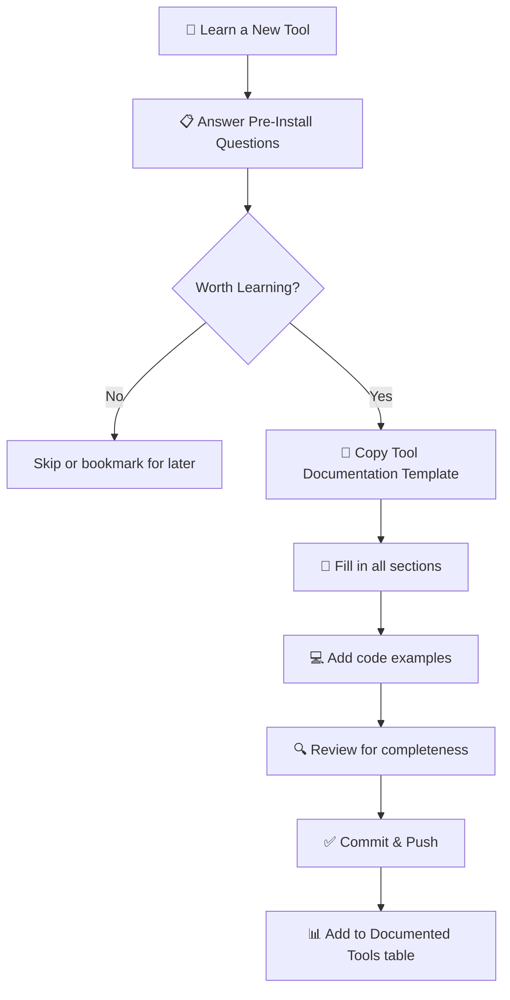

# 🛠️ Tools

> **Section 15** · Tool documentation, comparisons, and the universal Tool Documentation Template.

---

## 📋 Table of Contents

- [Overview](#-overview)
- [Tool Documentation Template](#-tool-documentation-template)
- [Documented Tools](#-documented-tools)
- [Tool Categories](#-tool-categories)
- [How to Document a New Tool](#-how-to-document-a-new-tool)
- [Related Sections](#-related-sections)

---

## 🔍 Overview

Every tool you learn deserves proper documentation. This section is the home for all tool documentation, using a standardized template that ensures consistency, completeness, and long-term usability. Instead of re-Googling the same tool commands and configurations, document it once and reference it forever.

---

## 📄 Tool Documentation Template

> ⭐ **This is the most important file in this section.**

Every new tool must be documented using this template:

### **→ [Tool Documentation Template](Tool_Documentation_Template.md)**

The template covers:
1. What the tool is
2. Why you should use it
3. When to use it
4. Where it works
5. Installation
6. How to use it
7. Development workflow
8. Best practices
9. Common mistakes
10. Useful commands
11. Real project example
12. Limitations
13. Alternatives
14. Resources
15. Personal notes

---

## 📚 Documented Tools

> 📝 *Tools will be documented here as they are learned.*

| # | Tool | Category | Status |
|---|------|----------|--------|
| 1 | Git | Version Control | 🔲 Planned |
| 2 | Docker | Containerization | 🔲 Planned |
| 3 | VS Code | Editor / IDE | 🔲 Planned |
| 4 | Node.js | Runtime | 🔲 Planned |
| 5 | Python | Language | 🔲 Planned |
| 6 | Firebase CLI | Backend Service | 🔲 Planned |
| 7 | Cursor | AI IDE | 🔲 Planned |
| 8 | Ollama | Local AI | 🔲 Planned |

---

## 🗂️ Tool Categories

| Category | Examples |
|----------|---------|
| 📝 Editors / IDEs | VS Code, Cursor, Android Studio, IntelliJ |
| 🔀 Version Control | Git, GitHub CLI |
| 📦 Package Managers | npm, pip, brew, choco, pnpm |
| 🐳 Containers | Docker, Docker Compose, Podman |
| ☁️ Cloud CLIs | AWS CLI, gcloud, Firebase CLI |
| 🤖 AI Tools | Copilot, Cursor, Ollama, Claude |
| 🧪 Testing | Jest, pytest, Cypress, Playwright |
| 🔧 Build Tools | Webpack, Vite, Gradle, Make |
| 📊 Monitoring | Prometheus, Grafana, Sentry |
| 🗄️ Database Tools | pgAdmin, MongoDB Compass, Redis CLI |

---

## 🔄 How to Document a New Tool

### Steps

1. **Copy** the [Tool Documentation Template](Tool_Documentation_Template.md).
2. **Rename** the file to `Tool_Name.md` (e.g., `Docker.md`).
3. **Fill in** every section with your knowledge and experience.
4. **Add** practical code examples and commands.
5. **Update** the "Documented Tools" table above.
6. **Commit** and push your changes.

---

## 🔗 Related Sections

| Section | Why It's Related |
|---------|-----------------|
| [01 · Project Setup](../01_Project_Setup/README.md) | Tools used in environment setup |
| [03 · AI Developer Tools](../03_AI_Developer_Tools/README.md) | AI-specific tool documentation |
| [10 · Cloud & DevOps](../10_Cloud_DevOps/README.md) | Cloud and DevOps tools |
| [14 · Checklists](../14_Checklists/README.md) | Tool evaluation checklists |

---

  <a href="../README.md">⬅️ Back to Home</a>

