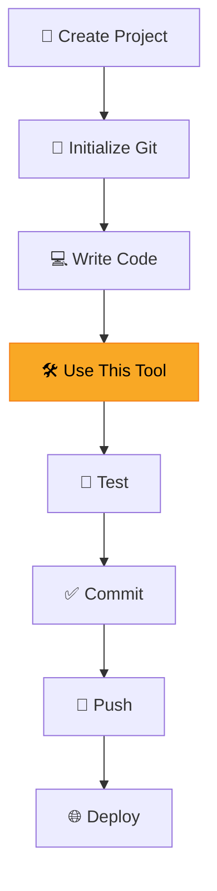

# 🛠️ [Tool Name]

> **Category:** `[e.g., CLI / IDE / Framework / Library / SDK / Service]`
> **Official Site:** [link]()
> **Documentation:** [link]()
> **GitHub:** [link]()
> **Last Updated:** `YYYY-MM-DD`

---

## 📋 Table of Contents

- [Before Installing This Tool](#-before-installing-this-tool)
- [1. What is This Tool?](#1-what-is-this-tool)
- [2. Why Should I Use It?](#2-why-should-i-use-it)
- [3. When Should I Use It?](#3-when-should-i-use-it)
- [4. Where Can I Use It?](#4-where-can-i-use-it)
- [5. Installation](#5-installation)
- [6. How to Use It](#6-how-to-use-it)
- [7. Development Workflow](#7-development-workflow)
- [8. Best Practices](#8-best-practices)
- [9. Common Mistakes](#9-common-mistakes)
- [10. Useful Commands](#10-useful-commands)
- [11. Real Project Example](#11-real-project-example)
- [12. Limitations](#12-limitations)
- [13. Alternatives](#13-alternatives)
- [14. Resources](#14-resources)
- [15. My Personal Notes](#15-my-personal-notes)

---

## ✋ Before Installing This Tool

> **Stop.** Before adding any new tool to your workflow, answer these questions honestly.

| # | Question | Answer |
|---|----------|--------|
| 1 | What problem does this tool solve? | `<!-- Your answer -->` |
| 2 | Why do I need this tool? | `<!-- Your answer -->` |
| 3 | Will I actually use it in my current or future projects? | ☐ Yes ☐ No ☐ Maybe |
| 4 | Is it better than the tool I already use? | ☐ Yes ☐ No ☐ N/A |
| 5 | Is it actively maintained and widely adopted? | ☐ Yes ☐ No ☐ Unknown |
| 6 | Is it compatible with my development stack? | ☐ Yes ☐ No ☐ Partially |
| 7 | Will it improve my productivity? | ☐ Yes ☐ No ☐ Maybe |
| 8 | Will I use it in multiple projects? | ☐ Yes ☐ No ☐ Maybe |
| 9 | Is it worth spending time learning? | ☐ Yes ☐ No ☐ Maybe |
| 10 | Should I install it now or later? | ☐ Now ☐ Later ☐ Never |

> **Decision:** ☐ Install Now ☐ Bookmark for Later ☐ Skip

---

## 1. What is This Tool?

<!-- 
Explain:
• What it is
• What it does
• What problem it solves

Keep this section short (2–4 paragraphs).
-->

**[Tool Name]** is a ...

### Key Features

- Feature 1
- Feature 2
- Feature 3

---

## 2. Why Should I Use It?

<!--
Explain:
• Why it exists
• Main advantages
• Benefits
• Productivity improvements
• Why developers use it
-->

### Advantages

| Benefit | Description |
|---------|-------------|
| ✅ Benefit 1 | Description |
| ✅ Benefit 2 | Description |
| ✅ Benefit 3 | Description |

### Who Uses It?

- Individual developers
- Open-source projects
- Companies: ...

---

## 3. When Should I Use It?

<!--
Explain:
• At what stage of development
• Best project types
• Recommended situations
• When NOT to use it
-->

### ✅ Use It When

- Situation 1
- Situation 2
- Situation 3

### ❌ Don't Use It When

- Situation 1
- Situation 2
- Situation 3

---

## 4. Where Can I Use It?

### Operating Systems

| OS | Supported |
|----|:-:|
| Windows | ☐ |
| macOS | ☐ |
| Linux | ☐ |

### Compatible With

| Category | Details |
|----------|---------|
| Programming Languages | e.g., Python, JavaScript, Go |
| Frameworks | e.g., React, Django, FastAPI |
| Editors / IDEs | e.g., VS Code, IntelliJ, Vim |
| CI/CD | e.g., GitHub Actions, Jenkins |

### Real-World Use Cases

1. **Use Case 1** — Description
2. **Use Case 2** — Description
3. **Use Case 3** — Description

---

## 5. Installation

### Prerequisites

Before installing, make sure you have:

- [ ] Prerequisite 1 (e.g., Node.js v18+)
- [ ] Prerequisite 2 (e.g., Git installed)
- [ ] Prerequisite 3

### Install

<!-- Add installation commands for each OS -->

**Windows:**
```powershell
# Installation command
```

**macOS:**
```bash
# Installation command
```

**Linux:**
```bash
# Installation command
```

### Verify Installation

```bash
# Verify the tool is installed correctly
tool-name --version
```

Expected output:
```
tool-name v1.0.0
```

### Update

```bash
# Update to the latest version
```

### Uninstall

```bash
# Remove the tool
```

---

## 6. How to Use It

### Basic Workflow


### 🟢 Beginner Example

> A simple example for first-time users.

```bash
# Step 1: Description
command here

# Step 2: Description
command here

# Step 3: Description
command here
```

**Expected Output:**
```
Output here
```

### 🟡 Intermediate Example

> A more practical, real-world example.

```bash
# Step 1: Description
command here

# Step 2: Description
command here
```

### 🔴 Advanced Example

> For power users and complex scenarios.

```bash
# Advanced usage
command here
```

---

## 7. Development Workflow

> Where does this tool fit in the development lifecycle?



### Integration Points

| Stage | How This Tool Helps |
|-------|-------------------|
| Setup | Description |
| Development | Description |
| Testing | Description |
| Deployment | Description |

---

## 8. Best Practices

> Professional recommendations for using this tool effectively.

### Do's ✅

1. **Practice 1** — Explanation
2. **Practice 2** — Explanation
3. **Practice 3** — Explanation
4. **Practice 4** — Explanation
5. **Practice 5** — Explanation

### Don'ts ❌

1. **Anti-pattern 1** — Why it's bad
2. **Anti-pattern 2** — Why it's bad
3. **Anti-pattern 3** — Why it's bad

---

## 9. Common Mistakes

> Mistakes beginners commonly make and how to fix them.

### Mistake 1: [Description]

**Problem:**
```
Error message or wrong behavior
```

**Solution:**
```bash
# Fix command or correct approach
```

**Why:** Explanation of why this happens.

---

### Mistake 2: [Description]

**Problem:**
```
Error message or wrong behavior
```

**Solution:**
```bash
# Fix command or correct approach
```

**Why:** Explanation of why this happens.

---

### Mistake 3: [Description]

**Problem:**
```
Error message or wrong behavior
```

**Solution:**
```bash
# Fix command or correct approach
```

**Why:** Explanation of why this happens.

---

## 10. Useful Commands

> Quick reference table for the most important commands.

| Command | Description | Example |
|---------|-------------|---------|
| `command1` | What it does | `tool cmd1 --flag` |
| `command2` | What it does | `tool cmd2 arg` |
| `command3` | What it does | `tool cmd3` |
| `command4` | What it does | `tool cmd4 --option` |
| `command5` | What it does | `tool cmd5 arg1 arg2` |
| `command6` | What it does | `tool cmd6 -v` |
| `command7` | What it does | `tool cmd7 --help` |
| `command8` | What it does | `tool cmd8 --config` |

---

## 11. Real Project Example

> A concrete example showing how this tool was used in an actual project.

### Project: [Project Name]

**Why it was used:**
- Reason 1
- Reason 2

**How it was integrated:**

```
project-name/
├── src/
│   ├── main.py
│   └── utils.py
├── [config-file-for-tool]     ← This tool's config
├── .gitignore
└── README.md
```

**Configuration:**
```yaml
# Tool configuration file
key: value
setting: option
```

**Benefits Gained:**
- Benefit 1
- Benefit 2
- Benefit 3

---

## 12. Limitations

> Be honest about what this tool cannot do.

| Limitation | Details | Workaround |
|-----------|---------|-----------|
| Limitation 1 | Description | Alternative approach |
| Limitation 2 | Description | Alternative approach |
| Limitation 3 | Description | Alternative approach |

### When to Use a Different Tool

- **If you need X** → Use [Alternative Tool] instead
- **If you need Y** → Use [Alternative Tool] instead

---

## 13. Alternatives

> Comparison with similar tools.

| Tool | Best For | Advantages | Disadvantages |
|------|----------|-----------|--------------|
| **[This Tool]** | Primary use case | Main strength | Main weakness |
| Alternative 1 | Use case | Strengths | Weaknesses |
| Alternative 2 | Use case | Strengths | Weaknesses |
| Alternative 3 | Use case | Strengths | Weaknesses |

### Recommendation

> When to pick which tool (1-2 sentences).

---

## 14. Resources

> Curated links for deeper learning.

### Official

| Resource | Link |
|----------|------|
| 📄 Official Documentation | [link]() |
| 💻 GitHub Repository | [link]() |
| 📋 Changelog / Releases | [link]() |

### Learning

| Resource | Type | Link |
|----------|------|------|
| Getting Started Guide | Tutorial | [link]() |
| Video Tutorial | Video | [link]() |
| Best Practices Article | Article | [link]() |

### Community

| Resource | Link |
|----------|------|
| Stack Overflow Tag | [link]() |
| Discord / Slack | [link]() |
| Reddit Community | [link]() |
| Twitter / X | [link]() |

---

## 15. My Personal Notes

> This section is for your personal experience with the tool. Update it as you learn.

### 📌 Commands I Use Frequently

```bash
# Add your most-used commands here
```

### 💡 Personal Tips

- Tip 1
- Tip 2
- Tip 3

### ❌ Errors I've Encountered

| Error | Cause | Solution |
|-------|-------|---------|
| `Error message 1` | Why it happened | How I fixed it |
| `Error message 2` | Why it happened | How I fixed it |

### 📝 Lessons Learned

1. Lesson 1
2. Lesson 2
3. Lesson 3

### 🔗 Projects Where I Used This Tool

| Project | How It Was Used | Link |
|---------|----------------|------|
| Project 1 | Description | [link]() |
| Project 2 | Description | [link]() |

---

<p align="center">
  <a href="README.md">⬅️ Back to Tools</a> · <a href="../README.md">🏠 Home</a>
</p>
