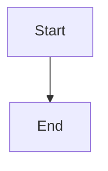

# 🤝 Contributing to Stan Dev Book

Thank you for your interest in contributing to **Stan Dev Book**! This repository is a personal developer knowledge base, and contributions that improve the quality, accuracy, or coverage of the documentation are welcome.

---

## 📋 Table of Contents

- [Code of Conduct](#-code-of-conduct)
- [How to Contribute](#-how-to-contribute)
- [Documentation Standards](#-documentation-standards)
- [File Naming Conventions](#-file-naming-conventions)
- [Commit Message Format](#-commit-message-format)
- [Pull Request Process](#-pull-request-process)
- [Style Guide](#-style-guide)

---

## 📜 Code of Conduct

- Be respectful and professional.
- Write clear, beginner-friendly documentation.
- Focus on accuracy and practical value.
- Keep content organized and consistent.

---

## 🛠️ How to Contribute

### 1. Fork the Repository

```bash
git clone https://github.com/your-username/stan_dev_book.git
cd stan_dev_book
```

### 2. Create a Branch

```bash
git checkout -b feature/add-docker-guide
```

### 3. Make Your Changes

- Add new documentation following the [Documentation Standards](#-documentation-standards).
- Fix typos, broken links, or formatting issues.
- Improve existing guides with better examples or explanations.

### 4. Commit Your Changes

```bash
git add .
git commit -m "docs: add Docker installation guide"
```

### 5. Push and Create a Pull Request

```bash
git push origin feature/add-docker-guide
```

Then open a Pull Request on GitHub.

---

## 📝 Documentation Standards

Every documentation page **must** follow these rules:

- [ ] Use professional GitHub-Flavored Markdown
- [ ] Include a Table of Contents at the top
- [ ] Be beginner-friendly — assume the reader is new
- [ ] Include syntax-highlighted code blocks
- [ ] Include checklists where applicable
- [ ] Include Mermaid diagrams for workflows and architecture
- [ ] Include practical, real-world examples
- [ ] Include step-by-step workflows
- [ ] Be searchable — use clear headings and consistent naming
- [ ] Be reusable — write content that can be referenced repeatedly

### For Tool Documentation

When documenting a new tool, **always** use the [Tool Documentation Template](15_Tools/Tool_Documentation_Template.md).

---

## 📁 File Naming Conventions

| Type | Convention | Example |
|------|-----------|---------|
| Folders | `XX_Folder_Name` (numbered, PascalCase) | `04_Python/` |
| Guide files | `PascalCase_With_Underscores.md` | `Virtual_Environments.md` |
| Template files | Descriptive name with `.md` extension | `Tool_Documentation_Template.md` |
| Assets | `lowercase-with-dashes` | `workflow-diagram.png` |

---

## 💬 Commit Message Format

Use the [Conventional Commits](https://www.conventionalcommits.org/) format:

```
<type>: <short description>

[optional body]
```

### Types

| Type | Usage |
|------|-------|
| `docs` | Adding or updating documentation |
| `fix` | Fixing typos, broken links, errors |
| `feat` | Adding a new section or major content |
| `chore` | Maintenance, reorganization, cleanup |
| `style` | Formatting changes (no content change) |

### Examples

```
docs: add Python virtual environments guide
fix: correct broken link in Git section
feat: add System Design section with diagrams
chore: reorganize Cloud & DevOps folder structure
```

---

## 🔄 Pull Request Process

1. **Ensure** your content follows the documentation standards.
2. **Test** all links and code examples.
3. **Describe** your changes clearly in the PR description.
4. **Reference** any related issues.
5. **Wait** for review before merging.

### PR Title Format

```
docs: [Section] Short description
```

Example:
```
docs: [04_Python] Add guide for virtual environments
```

---

## 🎨 Style Guide

### Markdown

- Use `#` for main title (only one per file)
- Use `##` for major sections
- Use `###` for subsections
- Use `####` for sub-subsections (sparingly)
- Use backticks for `inline code`
- Use triple backticks for code blocks with language specification
- Use tables for structured comparisons
- Use checklists (`- [ ]`) for actionable items
- Use blockquotes (`>`) for important notes

### Code Blocks

Always specify the language:

````markdown
```python
print("Hello, World!")
```
````

### Diagrams

Use Mermaid for diagrams:

````markdown

````

### Links

- Use relative links for internal references: `[Guide](../04_Python/README.md)`
- Use absolute URLs for external references: `[Python Docs](https://docs.python.org/3/)`

---

## ❓ Questions?

If you have questions about contributing, open an issue on the repository.

---

<p align="center">
  <strong>Thank you for helping make Stan Dev Book better! 🙏</strong>
</p>
