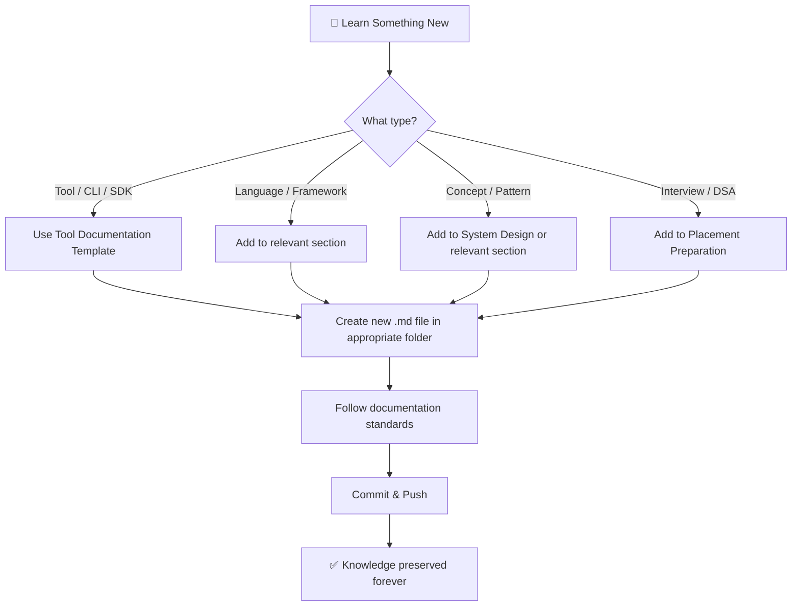

<p align="center">
  
</p>

<h1 align="center">📘 Stan Dev Book</h1>

<p align="center">
  <strong>A Lifelong Developer Knowledge Base · Software Engineering Handbook · Personal Playbook</strong>
</p>

<p align="center">
  <a href="#-about"></a>
  <a href="LICENSE"></a>
  <a href="CONTRIBUTING.md"></a>
  <a href="#-getting-started"></a>
</p>

<p align="center">
  <em>Document every technology, tool, framework, library, CLI, SDK, IDE, workflow, and best practice — once, permanently.</em>
</p>

---

## 📖 About

**Stan Dev Book** is a personal, ever-growing software engineering handbook. Instead of repeatedly searching the internet for the same concepts, commands, and workflows, everything is documented here — organized, searchable, and reusable.

### Why This Exists

- 🔁 **Stop re-Googling** — Document it once, reference it forever.
- 🧠 **Structured Learning** — Every new tool, language, or concept has a dedicated place.
- 🚀 **Career-Long Resource** — Scales from beginner notes to advanced engineering playbooks.
- 📐 **Consistent Format** — Every guide follows the same professional template.
- 🤝 **Shareable** — Clean enough to share with teams, mentees, and the community.

---

## 🗂️ Repository Structure

```
stan_dev_book/
│
├── README.md                    ← You are here
├── LICENSE                      ← MIT License
├── CONTRIBUTING.md              ← Contribution guidelines
├── .gitignore                   ← Git ignore rules
│
├── 01_Project_Setup/            ← Environment & project initialization
├── 02_Git_GitHub/               ← Version control & collaboration
├── 03_AI_Developer_Tools/       ← AI-powered development tools
├── 04_Python/                   ← Python language & ecosystem
├── 05_Web_Development/          ← Frontend, backend, & full-stack
├── 06_Android/                  ← Android app development
├── 07_Database/                 ← SQL, NoSQL, & data management
├── 08_AI_ML/                    ← Artificial Intelligence & Machine Learning
├── 09_Cybersecurity/            ← Security practices & tools
├── 10_Cloud_DevOps/             ← Cloud platforms & DevOps pipelines
├── 11_System_Design/            ← Architecture & design patterns
├── 12_Placement_Preparation/    ← Interview prep & DSA
├── 13_Project_Templates/        ← Starter templates & boilerplates
├── 14_Checklists/               ← Pre-flight checklists for projects
├── 15_Tools/                    ← Tool documentation & templates
│
└── assets/                      ← Images, diagrams, & media
```

---

## 🧭 Quick Navigation

| #  | Section | Description | Link |
|----|---------|-------------|------|
| 01 | **Project Setup** | Environment setup, IDE config, project initialization | [→ Open](01_Project_Setup/README.md) |
| 02 | **Git & GitHub** | Version control, branching, workflows, GitHub features | [→ Open](02_Git_GitHub/README.md) |
| 03 | **AI Developer Tools** | Copilot, Cursor, Claude, MCP, AI-assisted coding | [→ Open](03_AI_Developer_Tools/README.md) |
| 04 | **Python** | Python language, libraries, virtual environments, packaging | [→ Open](04_Python/README.md) |
| 05 | **Web Development** | HTML, CSS, JS, React, Next.js, APIs, deployment | [→ Open](05_Web_Development/README.md) |
| 06 | **Android** | Kotlin, Jetpack Compose, Android Studio, mobile dev | [→ Open](06_Android/README.md) |
| 07 | **Database** | SQL, PostgreSQL, MongoDB, Redis, ORMs, migrations | [→ Open](07_Database/README.md) |
| 08 | **AI & ML** | Machine learning, deep learning, NLP, computer vision | [→ Open](08_AI_ML/README.md) |
| 09 | **Cybersecurity** | Security fundamentals, encryption, OWASP, pen testing | [→ Open](09_Cybersecurity/README.md) |
| 10 | **Cloud & DevOps** | AWS, GCP, Docker, Kubernetes, CI/CD, IaC | [→ Open](10_Cloud_DevOps/README.md) |
| 11 | **System Design** | Architecture patterns, scalability, design principles | [→ Open](11_System_Design/README.md) |
| 12 | **Placement Prep** | DSA, interview questions, coding challenges, HR prep | [→ Open](12_Placement_Preparation/README.md) |
| 13 | **Project Templates** | Starter templates, boilerplates, scaffolds | [→ Open](13_Project_Templates/README.md) |
| 14 | **Checklists** | Pre-deployment, code review, project launch checklists | [→ Open](14_Checklists/README.md) |
| 15 | **Tools** | Tool documentation, templates, comparisons | [→ Open](15_Tools/README.md) |

---

## 🚀 Getting Started

### Prerequisites

- A GitHub account
- Git installed on your machine
- A code editor (VS Code recommended)
- Basic familiarity with Markdown

### Clone the Repository

```bash
git clone https://github.com/your-username/stan_dev_book.git
cd stan_dev_book
```

### How to Use This Repository

1. **Browse** — Navigate to any section using the table above.
2. **Learn** — Each folder contains structured guides with examples.
3. **Document** — When you learn something new, add it using the [Tool Documentation Template](15_Tools/Tool_Documentation_Template.md).
4. **Search** — Use GitHub's search (`Ctrl+K`) or your editor's search to find anything instantly.
5. **Grow** — This repository grows with your career. Keep adding to it.

---

## 📝 Documentation Standards

Every guide in this repository follows these rules:

| Rule | Description |
|------|-------------|
| ✅ Professional Markdown | GitHub-Flavored Markdown with proper formatting |
| ✅ Table of Contents | Every page has navigable sections |
| ✅ Beginner-Friendly | Written so anyone can follow along |
| ✅ Code Blocks | Syntax-highlighted, copy-paste ready examples |
| ✅ Checklists | Actionable checkbox items where applicable |
| ✅ Diagrams | Mermaid diagrams for workflows and architecture |
| ✅ Examples | Real-world, practical examples |
| ✅ Workflows | Step-by-step processes and pipelines |
| ✅ Searchable | Consistent naming and structure for easy search |
| ✅ Reusable | Templates and patterns you can copy into any project |

---

## 🔄 Workflow: Adding New Knowledge



---

## 🤝 Contributing

Contributions are welcome! Please read the [Contributing Guide](CONTRIBUTING.md) before submitting changes.

---

## 📄 License

This project is licensed under the **MIT License** — see the [LICENSE](LICENSE) file for details.

---

## ⭐ Support

If you find this repository useful:

- ⭐ **Star** this repository
- 🍴 **Fork** it and create your own version
- 📢 **Share** it with fellow developers
- 🐛 **Report** issues or suggest improvements

---

<p align="center">
  <strong>Built with 💙 by Stan</strong><br/>
  <em>One repository. Lifetime of knowledge.</em>
</p>
